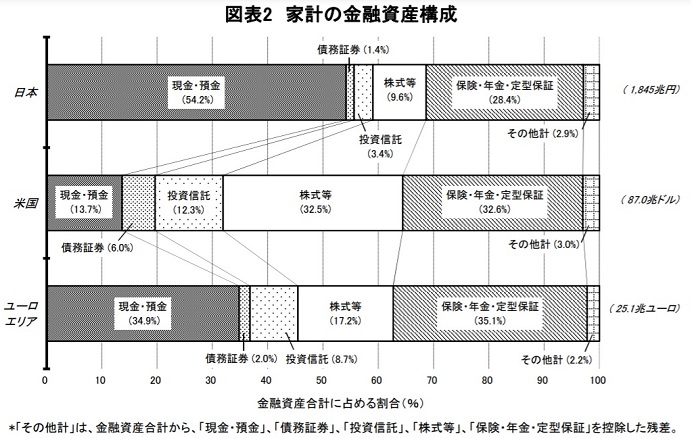
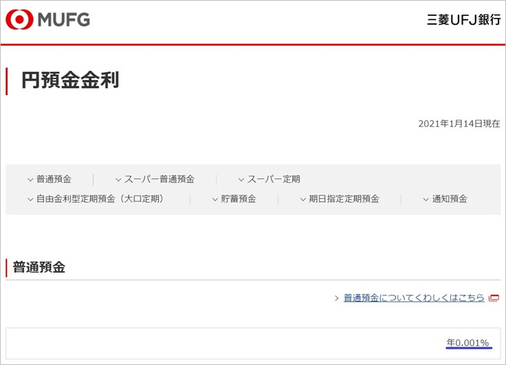
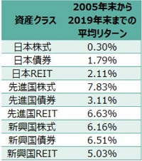
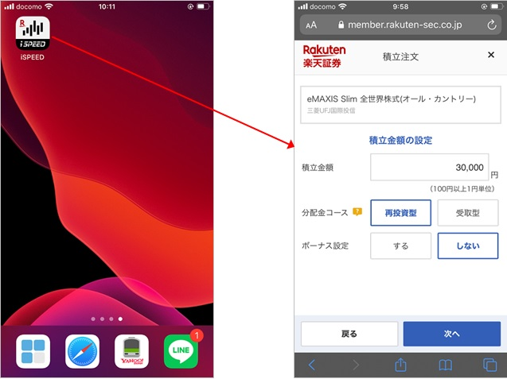

<head><link href="https://use.fontawesome.com/releases/v5.6.1/css/all.css" rel="stylesheet"></head>

 

投資について「危険」「難しい」というイメージを持ち敬遠している方が多いと思いますが、もし余剰資金があるのであれば、インデックス投資による長期分散投資を強くおすすめします。

せっかくの余剰資金を預貯金で眠らせておくのはあまりにももったいないです。

## 本記事で伝えたいこと

もし余剰資金を預貯金で抱えているのであれば、

今すぐネット証券の口座開設をし、グローバルなインデックスファンドに積立投資すべき

である理由について解説します。

 

##  日本人は預貯金以外への投資割合が少ない

 
 

日本人の資産の多くは預貯金で占められています。

以下の日本銀行の調査結果からもわかる通り、アメリカでは株式等の投資が預貯金よりも多いですが、日本は逆に預貯金の割合が多いです。

 

<a href="https://www.boj.or.jp/statistics/sj/sjhiq.pdf" class="centered-link">[引用元] 家計の金融資産構成 - 資金循環の日米欧比較（日本銀行調査統計局）</a>

 

「元本割れリスクのある投資は避けたい」「何に投資すればよいかわからない」「投資に必要な手続等が面倒くさい」等の理由で株式等への投資を敬遠し、預貯金をしている方も多いかと思います。

もちろん株式等の投資は元本割れのリスクが確かにありますが、それでも以下の点をおさえていけばリスクを抑えたうえで安定したリターンを得られるため、私は余剰資金を預貯金として保有している方は積極的に株式等への投資に回すべきだと考えています。

 
 

以下、その理由や賢く投資を行う方法について解説します。

 

## 預貯金ではなく投資をすべき理由

 
 

### 理由① 投資のほうが預貯金よりもリターンが高い

株式等へ投資した方が長期的なリターンが預貯金よりも高いです。

近年の超低金利相場において、預貯金の利率は非常に低いです。

 

以下の通り、三菱UFJ銀行の2021年1月時点の預金利率は0.001%です。もしこの金利で100万円を10年間預けても1000円しか増えません。

これでは預金の増加はほぼゼロですね。

 

一方で株式の長期的なリターンは以下の通りであり、預貯金に比べて桁違いに高いです。

もちろん、株式はREITなどのリスク資産は元本割れするリスクがありますが、長期的にみると預貯金に比べ高リターンが期待できます。

<a href="https://nextfunds.jp/semi/article37.html" class="centered-link">[引用元] 各資産クラスのこれまでのパフォーマンス</a>

仮にリターンが年率5%だとすると、複利効果が働くのでより長期間の運用になるほどリターンが増えます。

   <h4>株式5％運用と預貯金のリターン比較</h4>
    <li> 100万円を5%運用（10年間） ➡ 163万円（約1.6倍のリターン）</li>
    <li> 100万円を5%運用（20年間） ➡ 265万円（約2.7倍のリターン）</li>
    <li> 100万円を5%運用（30年間） ➡ 432万円（約4.3倍のリターン）</li>
    <li> 100万円を預貯金（30年間） ➡ 100万3千円（約0.003倍のリターン）</li>

 
 

### 理由② 素人でもプロ並みの投資リターンを手軽かつ低手数料で得られる 

投資と聞くと、「怪しい」「騙されるかも」といったネガティブなイメージを持たれる方はいまだに多いと思います。

ここで言いたいことは、以下の３点について正しく選択すればかなり安定的に資産を形成できる、という点です。

  <h4>投資に関して注意すべきポイント</h4>
    <ol>
      <li> 投資する金融商品</li>
      <li> 金融商品の購入先</li>
      <li> 投資手法</li>
    </ol>

 

株などの資産運用の失敗は以下の２パターンが多いと思います。

 

#### パターン①

投資信託などの金融商品を銀行や証券会社などの金融機関の言いなりで購入したが、利益どころか元本割れしてしまった（<b>金融商品</b>と<b>購入先</b>選択の失敗）。

 

#### パターン②

大幅下落相場（1990年代バブル、2000年初旬ITバブル、リーマンショック）にて痛い目を見た（<b>投資手法</b>の失敗）。

上記のような失敗は、以下の「理にかなった投資」により避けることが可能です。

 
 

## 理にかなった投資の仕方

上記のような失敗を防ぎ、安定的にリターンを得るための正しい投資の仕方を一言で言うと、

『グローバルなインデックスファンドをネット証券にて長期積立で購入』

です。
 
 

### ポイント①『グローバルなインデックスファンド』を購入

 
 

購入すべき金融商品は、「グローバルなインデックスファンド」です。

 

#### インデックスファンドとは？

インデックスファンドとは、日経平均やTOPICS、NYダウなど特定の市場平均指数に連動するように設計・運用されている投資信託です。

「日経平均株価」などの特定市場全体の株価の値動きに連動するため、「トヨタ自動車」など個別企業の業績（とそれに連動する株価）の影響を直接は受けず、市場全体の浮き沈みに沿った値動きになります。

 

#### インデックスファンドのメリット

特定銘柄ではなく「<b>市場全体の株価に連動するため値動きが安定している点</b>」がインデックスファンドのメリットです。

個別銘柄だとその企業の業績が急激に悪化した際に株価下落の影響をモロに受けますが、インデックスファンドの場合は多数銘柄の組み合わせであり、特定企業の業績や株価の影響が小さく、安定的なリターンが期待できます。

一方で特定企業の好業績をそのまま享受することはできません。

インデックスファンドは、株価の短期的な上下変化が小さく個別銘柄に比べリスクが低く、派手さはないが安定したリターンが期待できます。

 

#### グローバルなインデックスファンドのメリット

インデックスファンドには、日経平均株価に連動するファンドのように特定の国の株式に限定されるものから、世界中の株式に連動するファンドも存在します。

特定の国のみに投資を行うことは、その国の浮き沈みと運命を共にすることを意味します。

そのため、世界中に分散投資できるインデックスファンドのほうが、特定の国（例えば日本）のみのインデックスファンドに投資するよりも安定したリターンが期待できます。

少し前まで海外の株に投資するハードルは高かったですが、近年日本の証券会社からグローバルにインデックス投資できるファンドが開発されました。これらのファンドは非常に素晴らしく、私は「これらのファンドが<b>投資の民主化</b>に大きく貢献している」と考えています。

そのため、選択すべき金融商品は『グローバルなインデックスファンド』です。

グローバルに投資を行う際に為替影響が気になりますが、以下に説明する長期積立の投資手法によりそのリスクも抑えることが可能です。

 
 

### ポイント②『ネット証券』で購入する。

 

グローバルなインデックスファンドは「ネット証券」で購入すべきです。

金融商品は、金融機関から購入する必要があります。個人が東京証券取引所から株式を直接購入することはできません。

金融機関には大きく、野村證券、大和証券や三菱UFJ銀行といった窓口や担当営業マンと対面相談ができる「総合証券」と<b>SBI証券や楽天証券のような「ネット証券」</b>が存在します。

上記で購入をおすすめしたグローバルなインデックスファンドを購入するならば、ネット証券一択です。

 

#### ネット証券は売買手数料が激安

 

証券会社や購入条件によって異なりますが、イメージとしては100万円分の売買をした場合の手数料は、総合証券では２万円、ネット証券では１千円、といったレベルの違いがあります。

総合証券は、大きなビルや大人数の社員を抱えており、その固定費を賄うために金融商品購入時や売却時の手数料が高いです。

一方でネット証券は最低限のサービスのみ提供しているため、これらの手数料が低く抑えられています。

総合証券は、窓口や営業マンと相談しながら投資先を決めていくといった場合には心強いですが、購入する商品が決まっている場合はネット証券で十分です。

ネット証券の口座を開設し、スマホのアプリやウェブページから商品選択、購入額等の設定をするだけで非常に簡単に購入できます。

グローバルなインデックスファンドはプロに相談しなくても簡単に選択、購入することができます。

 
 

手数料が非常に安いネット証券で購入しましょう！

 
 

### ポイント③ 投資手法は、長期積立。

グローバルなインデックスファンドを長期的に一定額を毎月購入する手法が最適です。

例えば、特定のグローバルなインデックスファンドを毎月５万円分購入する、といった具合です。

 

#### 長期積立のメリット

 

<i class="fa fa-check" ></i> 短期的な価格の上下に影響されない

長期間毎月購入するとなると、短期的なインデックスファンド価格の上がり下がりを気にする必要がありません。

長期的に見ると、短期的な価格変動はただのばらつきととらえることができるからです。

短期的な（投機的な）価格変動にとらわれずに、長期的な（経済成長をベースとした）価格上昇に身を委ねます。

『安い時も高い時も一定額買い続ける』ことが基本姿勢となります。

「安いときにだけ買いたい」と思う方もいるかもしれませんが、それは不可能です。

なぜならば、いくらが安くていくらが高いか、というのは専門家でも判断が付きません。高いように見えても５年後１０年後に振り返ってみると実は安かったり、その逆もあり得ます。

 

<i class="fa fa-check"></i> ドルコスト平均法により平均売価を下げられる

「毎月一定額を購入する」ことにより、「一定株数を購入する」よりも平均売価を下げることができます。

なぜならば、一定額を購入いていくと価格が低いときにより多く、そして価格が高いときにより少ない株/債券その他証券を購入することになるからです。

一定株数を購入する場合に比べて、安い価格の時により多くの株/債券を購入できます。

少しわかりづらいかもしれませんが、毎月"一定額"購入すると平均売価が安くなる、と覚えておくとよいでしょう。

 

<i class="fa fa-check"></i> ほとんど手間がかからない

積立投資は自動設定が可能です。

最初に銘柄と積立額、また銀行からの自動入金設定を行えば、あとは毎月自動購入されます。

後は、何もする必要はありませんので、投資していることを忘れてしまってもいいくらいです（但し入金がショートしないように口座残高には注意が必要）。

日々の仕事や生活で忙しい方に最適の投資手法です。

 

## 代表的なインデックスファンド銘柄（2021年1月時点）

簡単ですが、グローバルなインデックスファンドとして代表的な銘柄をご紹介します。

あくまで一例なので、ご自身で運用方針を考えながら投資先ファンドを検討するのがよいです。

<a href="https://emaxis.jp/fund/253425.html" style="font-size: 20px;">eMAXIS Slim 全世界株式（オール・カントリー）- 三菱国際投信</a>

  先進国・発展途上国など世界中の国々の株式に分散投資（割合は各国の時価総額ベース）

 

<a href="https://www.rakuten-sec.co.jp/web/fund/detail/?ID=JP90C000FHC4" style="font-size: 20px;">楽天・全世界株式インデックス・ファンド - 楽天</a> 

  先進国・発展途上国など世界中の国々の株式に分散投資（割合は各国の時価総額ベース）

 

<a href="https://www.rakuten-sec.co.jp/web/fund/detail/?ID=JP90C000FHC4" style="font-size: 20px;">[世界経済インデックスファンド - 三井住友トラストアセットマネジメント</a> 

  日本国内外の株式と債券に分散投資。債券にも投資する分全世界株式インデックスファンドに比べると低リスク低リターン。手数料がやや高め。

  
 

## 投資の具体的な始め方

グローバルなインデックスファンドへの積立投資の始め方は以下の通り非常に簡単です。

#### ステップ①　ネット証券に口座を開設

<a href="https://www.rakuten-sec.co.jp/" style="font-size: 20px; margin-left: 40px;">楽天証券ホームページ</a>

   

 

<a href="https://www.sbisec.co.jp/ETGate" style="font-size: 20px; margin-left: 40px;">SBI証券ホームページ</a>
   
   

   

   
 

#### ステップ②　積立するインデックスファンドと額を決める

   例）[eMAXIS Slim 全世界株式（オール・カントリー）](https://emaxis.jp/fund/253425.html) を「毎月３万円」積立

   
 

#### ステップ③　アプリやウェブでインデックスファンドの積立設定を行う

   例）楽天証券 モバイルアプリ（iSpeed）

   

 
 

## まとめ

 

余剰資金を預貯金で眠らせておくのは非常にもったいないです。

低手数料でプロ並みの投資成績が期待できる「グローバルなインデックスファンド」を積立設定でネット証券から購入し、資産を増やしましょう！

 

