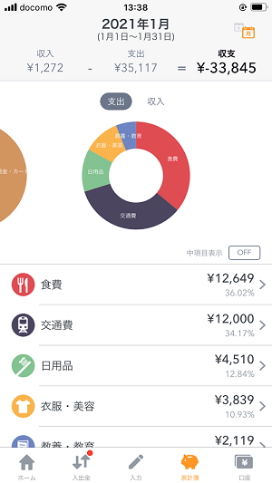
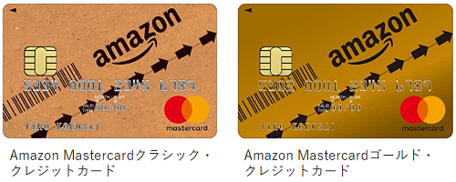
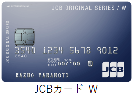
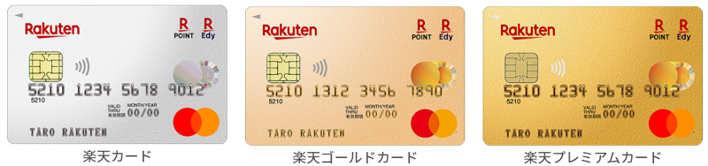
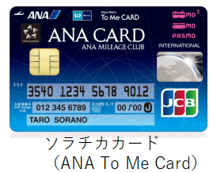

<head><link href="https://use.fontawesome.com/releases/v5.6.1/css/all.css" rel="stylesheet"></head>

 

現在、買い物や各種支払いに現金や銀行引き落としを使っている方は、節約のために全てクレジットカード支払いに切り替えるべきです。

クレジットカードを「浪費の象徴」と考えている方からすると暴論に聞こえるかもしれませんが、以下の点からクレジットカードが節約の味方であると理解いただけると思います。

 

## 本記事で伝えたいこと

 
 

節約をし毎月の収支に余裕を持ちのであれば、

現金払いを辞め、全ての支払いをクレジットカードに切り替えるべき

である理由について解説します。

 
 

## クレジットカードのメリット

 
 

節約できる、快適に買い物できる、安心できる、などクレジットカードのメリットについて解説します。

 
 

### ポイント還元

 
 

クレジットカードには支払額に応じたポイント還元があります。

カードや使用場所によりますが、通常年会費無料（または実質無料）のカードで0.5%～3%程度のポイント還元率です。

つまり100万円購入したら5000～30000円がポイントとして返ってくることになります。

[総務省統計局の調査](http://www.stat.go.jp/data/kakei/longtime/)によると、２人以上の世帯の年間平均支出額は約302万円とのことですので、全ての支出にポイント還元のあるクレジットカードをうまく使えば、年間のポイント還元は約15000円から90000円になります。

さらにポイントアップのキャンペーンなどをうまく利用すれば、年間10万円以上のポイント還元も夢ではありません。

月額約8000円の不労所得を稼ぐことができるとも言えます。一般家庭の光熱費にも相当する額であり、家計に余裕がでますね。

その一方で、全て現金払いだとすると１円も返ってきません。

 
 

できる限り、支払いをクレジットカードを通して行うべきです。

 
 

実際には、家賃の支払いなどクレジットカード払いが難しいものもありますが、最近は光熱費の支払いもクレジットカード払いが可能であり、ほとんどの支払いをクレジットカードで行うことが可能です。

 
 

一方、クレジットカードのポイント稼ぎについて注意すべき点もあります。

 

  <b><u>注意すべきポイント ポイント獲得は主目的ではない</u></b>
   
   
   
ポイント還元に誘惑されて、無駄な買い物をしたり、最安値でない場所で購入するのは本末転倒です。

   
「本当に必要な物をなるべく安い場所で購入する」という大原則の基に、より多くのポイント獲得をするという考え方が大事です。

    
   
そのためには、以下の順序で考えましょう

    
ステップ① ポイント還元が無くても買うものや買う場所をまずは選ぶ

    
ステップ② その上でポイント還元率の高いクレジットカードで支払う

 
 

### 家計簿を自動作成できる

クレジットカードで全て支払いを行えば、アプリを使った家計簿の自動作成が可能になります。

Money Forward MEなどの家計簿アプリはクレジットカード会社や通販会社などのシステムと連携し、支払情報（金額、購入日時、購入先、分類 等）を整理、分析してくれます。

複数のクレジットカードや銀行口座情報まで連携できるため、自身の資産額や毎月の収支確認も可能です。

家計簿により、月々の支払額や購入物などの購入履歴の見える化を行うことができ、節約に向けたヒントを得ることができます。

 
 

Money Forward MEアプリイメージ（[公式サイト](https://moneyforward.com/))

 
 
 

### 支払い時の手間がかからない

現金での支払いは面倒です。

 

財布から必要な支払額の紙幣や硬貨を取り出し、そしてお釣りをしまうという一連の動作を毎回行うのを面倒に感じる方も多いのではないでしょうか。

クレジットカードであればカードを読み取り機に差し込み（必要に応じてPINを打つ）だけです。

 

また、現金は都度ATMでおろす必要がありますが、クレジットカードであればそのような手間もかかりません。

 

クレジットカードに統一すれば、かさばる財布も持たなくてよくなります（現金支払いがどうしても必要な場合に備え、多少の現金は持ちますが）。

 

また、駅の改札でのPASMOやSUICAの自動チャージに対応しているクレジットカードもあり、これらのクレジットカードを使えば、都度残額確認やチャージをする必要がないので、非常に快適です。

 

以上ご説明しました通り、日々の生活をより快適にするという意味でも、支払を現金から全てクレジットカードに切り替えるのはありでしょう。

 
 
 

### セキュリティ的にも優れている

 
 

クレジットカードのセキュリティに不安をいただいている方もいらっしゃるかと思います。

「盗難、紛失やスキミングにより不正にクレジットカードを利用されないか」と心配をしている方も多いかもしれません。

 

実際は、正しい知識を持てばクレジットカードは現金よりも安全と言えます。

 

現金は盗難後に返ってくる非常に確率は低いですが、クレジットカードが不正利用された場合はよっぽどの落ち度がない限り、クレジットカード会社が補償してくれます。

また、現金と違いクレジットカードを紛失してもクレジットカード会社に連絡すれば紛失したカードを無効化し新しいカードを再発行できます。

 

そのため、セキュリティ面でも、現金よりもクレジットカードのほうが優れています。

  <b><u>注意すべきポイント</u></b>
   
   
   
クレジットカードの不正利用は残念ながら発生します。

   
私も不正利用された経験が１度あり、その時は行ったこともないインドネシアで十万円程度が引き落とされており、慌ててクレジットカード会社に連絡し、クレジットカード会社が不正利用額を補填してくれました。

    
   
もし運悪く不正利用されてしまった場合はよっぽどの落ち度がない限り、クレジットカード会社が補償してくれるので、落ち着いて対応しましょう。

    
    
重要な点は、不正利用に気づくことです。今ではスマホアプリやウェブで簡単に利用履歴を確認できるので１カ月に１度など定期的に確認するようにしましょう。

 
 
 

## クレジットカードの選び方

 
 

クレジットカードはあくまで「お金を支払うための道具」です。

 

「人気があるから」「ポイント還元率が高いから」という理由で安易にクレジットカードを選ぶのではなく、自身の生活スタイル（消費スタイル）に合わせて選びましょう。

 

特定のクレジットカードを推奨する意図は全くありませんが、参考までに私のクレジットカードの選び方を紹介します。

 
 

### 自身の消費スタイルからクレジットカードを選ぼう

 
 

あなたの消費スタイルはどのようなものですか。どこで何にお金を使っていますか？

まずは自身の消費スタイルを把握し、それに応じて最適なクレジットカードを選びましょう。

 

私の場合は、以下のような感じです。

  <li>雑貨や保存の利く飲食物（特に米や水など重いもの）の多くをAmazonと楽天市場で購入</li>
    <li>生鮮食品はスーパーで購入</li>
    <li>衣料品はアパレル店舗で購入</li>
    <li>楽天証券で積立投資を毎月実施</li>
    <li>首都圏に住んでおり移動手段は電車をよく使う</li>

 
 

私は、以下の理由で楽天カードとAmazon Mastercardクラシック・クレジットカード、ソラチカカードを持っています。

 

<h4>ネット通販</h4>

  <b><u style="font-size: 20px;">Amazon.comを頻繁に利用</u></b>

  Amazon.comをよく利用するため、Amazon.comにおいて高ポイント還元率である「Amazon Mastercardクラシック・クレジットカード（2.5~3%）」を使用しています。

    

  Amazonを頻繁に利用する場合は、「Amazon Mastercardクラシック・クレジットカード」や「JCB カード W」などの選択肢があります。

 

<i class="fa fa-check"></i> Amazon Mastercardクラシック・クレジットカード（年会費は実質無料）<a href="https://www.amazon.co.jp/s?k=amazon+%E3%82%AF%E3%83%A9%E3%83%83%E3%82%B7%E3%83%83%E3%82%AF+%E3%82%AB%E3%83%BC%E3%83%89&hvadid=387051971251&hvdev=c&jp-ad-ap=0&tag=yahhyd-22&ref=pd_sl_70apw4bkl9_b">（公式サイト）</a>

  Amazon Mastercardクラシック・クレジットカードを使うと、Amazonでのショッピングには通常で1.5%, Amazonプライムに加入済みの場合は2.0%ポイントが付き、クレジットカード無しでもAmazonポイントが1%つくので、合計ポイントは「2.5%または3.0%」となります。

    

  「Amazon Mastercardゴールド・クレジットカード」という上位カードがありますが、年会費（10,800円）を考えると、ヘビーユーザーでない限り「Amazon Mastercardクラシック・クレジットカード」で十分です。

    

  

    
 
 

<i class="fa fa-check"></i> JCBカード W（年会費無料）<a href="https://www.jcb.co.jp/promotion/ordercard/w/ex/?13235043152100&ad_id=cojp_osw2pc_lst_y_b_2016o_os0747&utm_medium=lst__oss&utm_source=yahoo__oss&utm_term=00073979__oss__B&utm_campaign=00073979__oss__B&yclid=YSS.1000122715.EAIaIQobChMIne_VwNWi7gIVUEFgCh0q0g7REAAYASAAEgKRrvD_BwE">（公式サイト）</a>

JCBカード Wは、AmazonでOki Dokiポイント1000円当たり4ポイント還元されます。

    

Oki Dokiポイントの換算レートは換算先により異なり、

「Oki Dokiポイント 1ポイント＝5円」の場合に「4ポイント×5円＝20円」なので「20円÷1000円＝2%」の還元率となります。

    

Amazonでは、「Oki Dokiポイント 1ポイント＝3.5円」なので、還元率が1.4%となり、Amazonでポイント"利用"する場合、Amazon Mastercardクラシック・クレジットカードのほうが有利です。

注）年齢制限があり、申し込めるのが39歳までです。

    
 
 
 
    
<b><u style="font-size: 20px;">楽天市場を頻繁に利用</u></b>

 
 
 

<i class="fa fa-check"></i> 楽天カード（年会費無料）<a href="https://www.rakuten-card.co.jp/campaign/rakuten_card/listing/a.html?sclid=o_rkc_campaign_listing_pc">（公式サイト）</a>

楽天証券を使って積立投資をしており（毎月５万円までポイント還元対象）、また楽天市場をAmazonほどではないが利用するため「楽天カード（一般カード）」を使用しています。

    

楽天市場をよく利用するなら、選択すべきクレジットカードは楽天カード一択です。楽天カードはプレミアムカード、ゴールドカード、一般カードと言ったランクがあり、ランクに応じてポイント還元率や特典が異なります。

    

楽天市場のヘビーユーザーでない限り、年会費無料の「楽天カード（一般カード）」で十分です。

    

ポイントは楽天市場の通常利用で３％（通常還元１％＋楽天カード利用２％）、SPUと呼ばれるポイントアップ制度や特定日のセールによってより高いポイント還元率となります。

少し複雑なので、楽天カード公式サイトや関連ブログなどで勉強してみるとよいでしょう。

 

 
 
  

  
<h4>店頭店舗</h4>

  店頭店舗での支払いは「楽天カード」または「Amazon Mastercardクラシック・クレジットカード」で行います（共に、原則1%還元）。

  店舗や契約店ごとに「より還元率の高いカード」はありますが、全部に対応しようとすると多数のカードを持たないといけないため不便ですし、ポイントの融通が利きません。

 
 

<h4>その他</h4>

<i class="fa fa-check"></i> ソラチカカード（年会費 2,200円）<a href="https://www.jcb.co.jp/promotion/jcb_anacard/cp3.html?15568542750100&ad_id=cojp_anasmpc_lst_o_an0043&utm_medium=lst__ana&utm_source=yahoo__ana&utm_term=00074007__ana&utm_campaign=00074007__ana__C&yclid=YSS.1000122713.EAIaIQobChMI5rL-7dCi7gIVUnZgCh2N9Q1LEAAYASAAEgKf5vD_BwE">（公式サイト）</a>

  ソラチカカードは、カードの残額が少なったときに改札で自動チャージされます。そのため券売機で逐一チャージを行う必要がなく、非常に便利です。

  難点は年会費が無料でない（2200円）かかることですが、（個人的には）利便性を考えると払う価値があると思っています。

 
 
 

## まとめ

クレジットカードを賢く選べば、非常にお得で節約になります。

最適なクレジットカードは各々の購買スタイルによるので、購買額や購入頻度の高い場所でより多くのポイント還元を得られるように、クレジットカードを選択しましょう。

現金払いを止め、お得なクレジットカード生活に切り替えましょう！

 
 
 