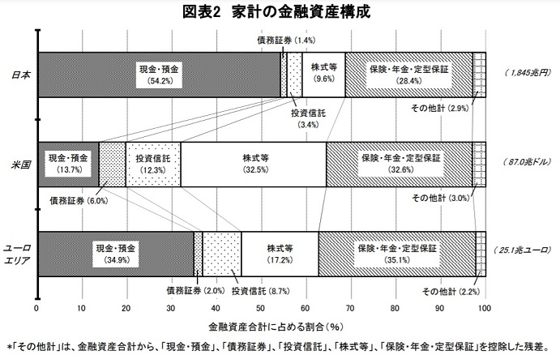
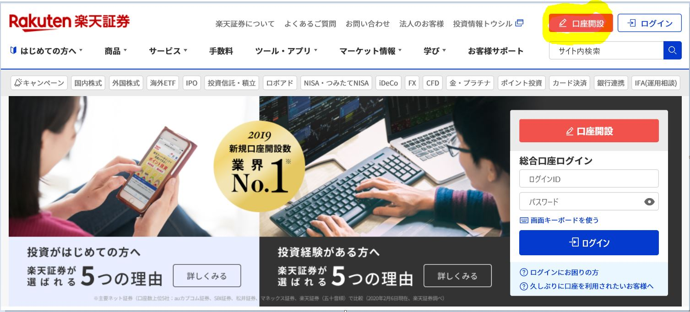
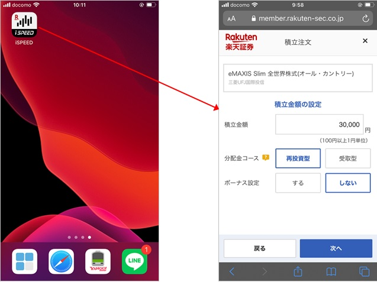

<head><link href="https://use.fontawesome.com/releases/v5.6.1/css/all.css" rel="stylesheet"></head>

 
 

日本人は投資よりも貯蓄を好む傾向があります。

 

以下の日本銀行の調査結果からもわかる通り、アメリカでは株式等の投資が預貯金よりも多いですが、日本は逆に預貯金の割合が多いです。

<a href="https://www.boj.or.jp/statistics/sj/sjhiq.pdf" class="centered-link">家計の金融資産構成 - 資金循環の日米欧比較（日本銀行調査統計局）</a>

 
 

元本割れの可能性がある株式投資などに対して「投資は怖い」「投資は難しい」といったマイナスイメージを持っている方が多いのが理由の１つだと思います。

 

一方で、世界の株式市場に目を向けると米国市場を中心に過去何十年にもわたり（短期的な上がり下がりはあるものの）右肩上がりです。

この流れに乗れれば、貯蓄するよりも大幅に速いスピードで資産を増やすことができます。

余剰資金を貯蓄に眠らせておくのが非常にもったいない理由について、以下の記事でも解説しています。

[☞参考記事：余剰資金はインデックス投資すべき理由](https://www.middle-age-survival.com/post-four)

 
 

問題は、投資知識のない人にとって投資をどのように始めてよいかわからないという点です。

証券会社に頼るという方法もありますが、手数料が高くお試しで始めるにはハードルが高いと思う方も多いでしょう。

 

そうした投資初心者の方に非常におすすめなのが『ネット証券を使ったインデックス投資』です。

 
 

## インデックス投資とは

 
 

インデックス投資とは、特定の指標（インデックス）と同じ値動きをする投資信託への投資手法です。

例えば、日経平均株価や東証株価指数TOPIX、アメリカのダウ平均株価、また世界全体や複数の国の株価指数に連動する投資信託も存在します。

特定企業の個別株（トヨタ自動車の株 など）ではなく、「市場全体の値動きに連動する投資信託」への投資手法です。

 
 

## インデックス投資が初心者に超おすすめな理由

 
 

#### 投資に関する知識がほとんどいらない

 
 

インデックス投資は、「特定の指標の値動きに連動させる投資信託」へ長期投資です。

これは言わば、長期視点で市場全体の流れに乗る行為であり、特定企業への投資をするわけではありません。

そのため、個別企業の財務分析、特定業界の動向分析、などがほぼ不要です。また短期的な売買をしないのでマクロ経済の短期的な動向（景気良し悪しなど）も気にする必要がありません。

そのため、金融や経済の知識がない方でも、すぐに始めることができます。

 
 

#### プロ並みの投資成果（利回り）が期待できる

 
 

インデックス投資は、投資のプロとそん色ない投資利回りが期待できます。

日経平均や米国ダウ平均株価と連動するインデックス投資をパッシブ投資（運用）と言います。インデックスの値動きに受け身（パッシブ）で合わせていくためそのように呼ばれています。

その一方で、インデックス投資よりも高い利回りを狙う投資をアクティブ投資（運用）と言います。インデックスを上回る投資利回りを出すために、投資のプロが頭をひねって運用します。

ここでポイントは、パッシブ運用（インデックス投資）はアクティブ運用の平均値を上回るという研究結果や投資実績が明らかになっていることです。

つまりは、「投資のプロが一生懸命投資利回りを上げようと頑張っても、インデックス投資を超えることができない」ということです。

もちろん、あくまでここでの比較はアクティブ運用の「平均」であり、実際にはインデックス投資を上回る成果を上げているアクティブ運用ファンドは存在します。

ここで言えることは、「インデックス投資は投資のプロの運用とそん色ない運用利回りが期待できる」という点です。

 
 

#### 投資手数料を非常に低くおさえることができる

 
 

インデックス投資はネット証券と組み合わせると投資手数料を非常に低くおさえることができます。

インデックス投資は、低いもので販売・運用手数料が年間0.1-0.2%ですが、アクティブ運用は運用手数料だけで年間1-3%程度します。

手数料が3%の場合、100万円を運用していると年間３万円支払わなくてはなりません。

長期投資は利回りが命ですので、手数料でその利回りが奪われてしまうのは望ましくありません。

 
 

#### 手間がほとんどかからない

 
 

インデックス投資の投資手法は、基本的に長期間投資です。

短期的な売買をする必要が無いので、購入後は放っておいても問題ありません。また毎月積立購入するような場合も証券会社のアプリなどで自動積立設定をすれば、自分で毎月購入する必要がありません。

インデックス投資は、銘柄選定をして購入や積立設定した後は「投資していることを忘れてしまう」というのがよい心構えと言われている所以です。

 
 

#### 価格が急減したり、倒産して株が紙くずになる心配がない

 
 

特定の企業に投資していると、その企業の業績が急激に悪くなったり最悪倒産して、株価が急減したり株が紙くずになる可能性があります。

それに対してインデックス投資は多数の企業に分散投資しているので、個別株やアクティブ投資に比べて値動きが安定しており、投資リスクが低いです。

 
 

## インデックス投資のデメリット

 
 

#### 面白味がない

 
 

上記の通り、インデックス投資は銘柄選定等の最初の手続きを終えれば、後は基本的に何もすることがありません。

個別銘柄であれば企業の調査をしたり比較的短期に売買したりと、考え工夫を凝らしたり、短期の成果に一喜一憂するのですが、インデックス投資はそのような作業が不要であり感情の動きもあまり伴わないため、基本的に退屈です。

投資を趣味としたいならば、インデックス投資だけでは「楽しむため」には少し物足りないと思います。

 
 

#### 投資知識を学びにくい

 
 

上記「面白味がない」理由と似ていますが、インデックス投資は銘柄選定後はほとんど考えることがありません。

これは「手間がかからない」という点ではメリットですが、「投資知識を学ぶ」という意味ではデメリットです。

ほとんど考えなくても投資成果が出てしまうので、どうしても投資知識を学ぶ意欲が湧きづらくなります。

もちろん、全く投資をしないよりは、投資に触れる機会を持てますので、投資を学ぶきっかけになるとも言えます。

 
 

#### 豊かになっている実感が得られない

 
 

インデックス投資は、配当金（インカムゲイン）ではなく値上がり（キャピタルゲイン）を追求します。

そのため、投資成果が好調だったとしても実際に私達の財布にお金が入ってくるわけではありません。

実際に手元にお金を得られるのは、そのインデックスファンドを取り崩したり解約する時であり、超長期視点のインデックス投資だとそれは定年後・老後など何十年も先の話です。

そのため、インデックス投資をしている間は日々の生活が豊かになっている実感をなかなか得られません。

その代わりに「豊かな将来」を育てていると考えることが大事です。

 
 

#### 棚ぼたは期待できない

 
 

インデックス投資は多数の株式を組みあわせてうまくインデックスの値動きに連動させています。

そのため、個別株を買う場合に比べて安定していますが、逆に言うと宝くじのような大幅な儲けを短期的に得られることはありません。

もし、AmazonやGoogle、Facebookの株を上場当時に購入し今まで保有していたら億万長者になれたと思います。

このように個別株であれば確率は非常に低いですが、宝くじのようなリターンを得られる可能性がありますが、インデックス投資ではそのような夢を見ることはできません。

 
 

以上、インデックス投資のメリットとデメリットを紹介しました。

繰り返しですが、インデックス投資は初心者でもプロ並みの投資利回りを手間をかけずに簡単に得られる非常に素晴らしい投資手法です。

貯金で余剰資金を眠らさせているくらいならインデックス投資をするべきです。

 
 

## インデックス投資の始め方の手順

 
 

では、実際にどのようにインデックス投資を始めればよいのでしょうか。

その手順について以下に簡単に紹介します。

 
 

### ステップ① 投資目的の確認

 
 

インデックス投資は長期投資が基本です。

今から何十年といった遠い将来の自分や家族の生活のために投資を行うという目的を再確認しましょう。

もし、短期的な投資リターンを得たいようでしたら、個別株や高配当金銘柄への投資などインデックス投資よりも向いている投資手法がありますので、今一度インデックス投資で行くべきか再考しましょう。

 
 

### ステップ② 投資先と投資額、投資手法の決定

 
 

#### 投資先選定

 
 

インデックス投資と言っても多数の銘柄がありますので、投資先銘柄を決めます。

選定において重要なのは、以下２点です。

- どの国・地域が対象なのか
- 商品は株式なのか債券なのか不動産か

例えば、「日経平均株価（日本ｘ株式）に連動するインデックス投資」「全世界の株式に連動するインデックス投資」「全世界の株式と債券等のバランス型インデックス投資」などです。

 

個人的なおすすめは、世界株式インデックスファンドです。

特定の国ではなく世界中の株式に投資するため、より広くリスク分散ができます。

 

ご参考までに、以下は代表的な世界株式インデックスファンドの銘柄です（2021年2月時点）。

<a href="https://emaxis.jp/fund/253425.html" style="font-size: 20px;">eMAXIS Slim 全世界株式（オール・カントリー）- 三菱国際投信</a>

  先進国・発展途上国など世界中の国々の株式に分散投資（割合は各国の時価総額ベース）

 

<a href="https://www.rakuten-sec.co.jp/web/fund/detail/?ID=JP90C000FHC4" style="font-size: 20px;">楽天・全世界株式インデックス・ファンド - 楽天</a> 

  先進国・発展途上国など世界中の国々の株式に分散投資（割合は各国の時価総額ベース）

 

<a href="https://www.rakuten-sec.co.jp/web/fund/detail/?ID=JP90C000FHC4" style="font-size: 20px;">[世界経済インデックスファンド - 三井住友トラストアセットマネジメント</a> 

  日本国内外の株式と債券に分散投資。債券にも投資する分全世界株式インデックスファンドに比べると低リスク低リターン。手数料がやや高め。

 
 

#### 投資額を決める

 
 

月々捻出することができる額から決めるのか、あるいは将来ほしい金額を基準に逆算して決めるのか、です。

<i class="fa fa-check" ></i> 月々捻出できる額から決める

　　例）月々３万円であれば継続して捻出できる見込みであれば、月々３万円を積立額として決めます。

 

<i class="fa fa-check" ></i> 将来ほしい金額をもとに決める

　　例）３０年後に３０００万円にしたいならば、年率リターンを５％と見て月々37,000円積み立てる

　　計算には以下のようなシミュレータが便利です。

  　　[☞ 積立かんたんシミュレーション](https://www.rakuten-sec.co.jp/web/fund/saving/simulation/)

 

まずは、月々余裕を持って捻出できる額から始めてみるのもよいと思います。

 
 

#### 投資手法

 
 

インデックス投資は長期積立が原則です。長期積立ではないとインデックス投資の強みを活かせません。

<b>月々一定額を積立購入</b>するのがおすすめです。

<b>「一定株数」ではなく「一定額」がポイント</b>です。「一定額」とすることにより価格が安いときにより多くの株数を変えるからです（この手法を「ドルコスト平均法」と言います）。

 
 

### NISAやiDeCoの活用検討

 
 

インデックス投資をするならば、NISAや積立NISA、iDeCoという税金優遇制度の活用を検討すべきです。
証券会社から簡単に申し込むことができます。

 

<i class="fa fa-check" ></i> NISAと積立NISA

NISAや積立NISAは投資によって得た利益が非課税になる制度です。

つまり、通常投資から得た利益には20%の税金がかかりますが、これが非課税になります。

但し、積立額と非課税期間に上限があり、それぞれ「NISA：年間120万円 / ５年間非課税」「積立NISA：年間40万円/ 20年間非課税」となります。

長期投資原則のインデックス投資には積立NISAが向いています。

積立NISAは国の基準を満たした長期運用向け投資信託にしか選べませんが、その中にインデックス投資は含まれているので問題ありません。

 

<i class="fa fa-check" ></i> iDeCo

  iDeCoは、NISA/積立NISAよりも税金面でさらに優遇されています。
  
  投資利益に税金がかからないだけでなく、月々支払う積立金が所得税や住民税の控除対象となります。

  例えば月２万（＝年間２４万円）積み立てたとすると、年間所得に対してiDeCo積立の２４万円を引いた額が控除されます。もし所得税率が２０％だとすると、24万円×20%=4.8万円が所得税から控除されます（つまり4.8万円の得）。

  ただし、60歳になるまで原則資産を引き出すことができません。途中で「やっぱりお金を使いたいから」と60歳手前で解約したりお金を引き出したりすることは原則できません。

  「60歳まで手を付けずに済む資金」があるならば利用しない手は無い制度です。

 
 

### 証券会社の選択

 
 

証券会社には、野村證券のような店舗や担当営業マンのいる対面証券会社（総合証券）とインターネットで完結しているネット証券会社があります。

インデックス投資を行う際は、絶対にネット証券を選択すべきです。

理由は、ネット証券の手数料が格段に安いから、です。

 

対面証券は、担当営業マンにいろいろな相談ができる点は便利ですが、インデックス投資は営業マンに相談するまでもない簡単な投資法です。またインデックス投資は毎年運用利回りを複利で雪だるま式に増やしていく方式なので、毎年引かれる手数料は限りなく抑えなくてはなりません。

そのため、インデックス投資を行うならば「ネット証券」一択です。

 

ネット証券のなかでも手数料が安いのがSBI証券と楽天証券です（2021年時点）。インデックス投資の取り扱いに大きな差はありませんので、好みに合わせて選びましょう。

私は楽天証券をメインに使っており、楽天カードと組み合わせると毎月500円分の楽天ポイントがもらえる点、また楽天アプリiSPEED上で日経新聞が無料で読める点、について非常に重宝しています。

 
 

### 証券会社の口座開設

 
 

まずは、ネット証券に口座を開設しましょう。

以下のホームページから口座を簡単に開設することができます。

<a href="https://www.rakuten-sec.co.jp/" style="font-size: 20px; margin-left: 40px;">楽天証券ホームページ</a>

   

 

<a href="https://www.sbisec.co.jp/ETGate" style="font-size: 20px; margin-left: 40px;">SBI証券ホームページ</a>

   

 

 
 

### 投資・積立設定

 
 

ネット証券のモバイルアプリやホームページ上で簡単に積立設定できます。手続きの中で、積立資金の引き落とし銀行口座の設定も必要です。

  例）楽天証券 モバイルアプリ（iSpeed）

  

 
 

積立設定をしてインデックス投資を開始した後は、基本的に放置でOKです。

 
 

## まとめ

 
 

インデックス投資がおすすめな理由を解説しました。

今の超低金利の時代に全財産を貯金しておくのは非常にもったいないことです。

ありがたいことに、現在は初心者でも手間をかけずにプロ並みの投資成果を上げることができる手法・仕組みがあります。

余剰資金をインデックス投資して、将来に備えた資産形成を行いましょう。

 