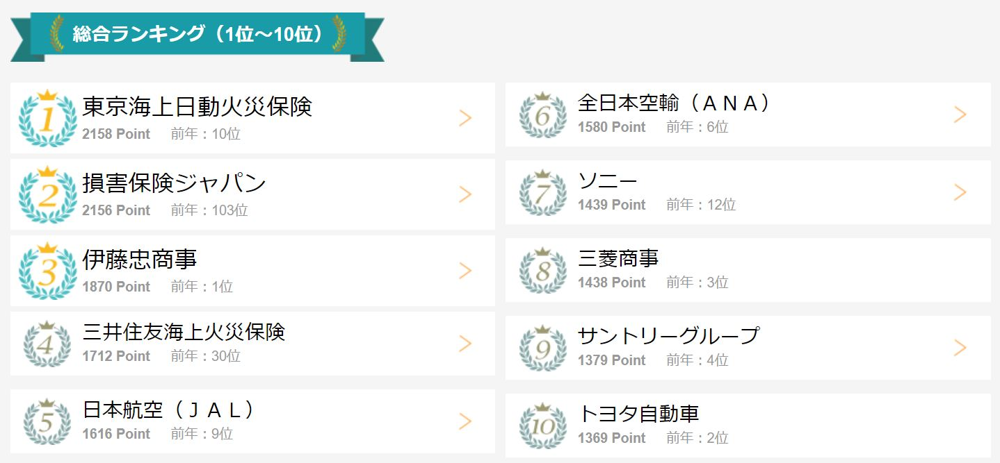

<head><link href="https://use.fontawesome.com/releases/v5.6.1/css/all.css" rel="stylesheet"></head>

 

## 日系大企業は今なお学生人気が高い

日系大企業は、今も昔も学生にとって人気の就職先です。

最近は、外資系やベンチャー企業の人気が高まってきていますが、

相変わらず、大手メーカー、総合商社、大手金融機関、製薬会社など、
「安定している」「給料がいい」「親や親族を安心させられる」「合コン受けがいい（笑）」といった理由で日系大企業を就職先として選ぶ学生が多いです。

 

事実、人気就職先ランキングには多くの日系大企業がランクインしています。

<a href="https://job.career-tasu.jp/2021/guide/study/ranking/1_1.html" class="centered-link">2021年就職希望企業総合ランキング（キャリタス就活2021）</a>

 

私自身も学生時代は特に深く考えずに、日系大企業に絞って就職活動していました。

今思い返すとあまりにも稚拙だったと恥ずかしくなりますが、「とりあえず名の通った企業に就職できればいい」くらいにしか考えていませんでした。

典型的なダメ学生ですね。。。

また、社会人１２年目に一度転職を経験しましたが、その際も日系大企業への転職を選択し、今もその企業に勤務しています。

外資系企業への転職も考えましたが、失敗のリスクも考慮し日系大企業を選択した、というのが正直なところです。

 

このように私自身、現在も日系大企業に勤めていますが、将来に対して不安感や閉塞感を感じています。

本記事では、現役で日系大企業に勤務する私自身の視点で、大企業のメリット、デメリット、そして検討すべきアクションを紹介します。

日系大企業に勤務している人や就職、転職を検討している人の参考になったり、共感いただけたらうれしいです。

まずは、いまだに日系大企業が人気である理由について改めて考えてみたいと思います。

 

## 日系大企業に就職するメリット

 
 

### 雇用が安定している

 

  近年、日系大企業のリストラがたびたび報道されるようになりました。

  それでも「いつ倒産するかわからない中小企業」「いつ解雇されるかわからない外資系企業」に比べると雇用に対する安定感は段違いです。

   

  東京商工リサーチによりますと、2019年度の倒産件数は8631件でした（[2019年度（令和1年度）の全国企業倒産8,631件](https://www.tsr-net.co.jp/news/status/year/2019.html)）。
  
  その全てが非上場企業であることからも中小企業のほうが倒産リスクが高いことがわかります（注. 非上場企業＝中小企業ではありません）。

   

  また、外資系企業は日系企業に比べ人材の新陳代謝が高く、成果を上げられないと長く所属することが難しいです。

  

  私は十何年も日系大企業で働いてきましたが、仕事ができない人/やる気がない人（主におじさん…）を山ほど見てきましたが、誰一人として会社を追われることはありませんでした。

   

  経済が悪化しても倒れず、成果が出せなかったとしても雇用が脅かされることがほぼ無い、それが日系大企業です。

 

### 中小企業と比べると高い給与や手当

  有名外資系企業には劣りますが、中小企業に比べると日系大手企業の給与は高いです。業績が悪くてもボーナスはしっかり出ます。

  また住宅手当等の福利厚生も充実しており、生活の余裕度合いが違ってきます。

  

  日系大企業であっても近年は成果評価制度が導入されているため、評価によって昇給スピードには差が付きます。
  ただ、その差は非常に小さく多くの社員が横並びで昇給していきます。
  30代半ばくらいから昇格可否により差が付きますが、それでも給与の差は限られます。

  

  また、社宅や住宅手当も支給されるため、最も高額な支出である住宅費を低く抑えることができ、家計に余裕ができます。

  

  管理職にならないとなかなか年収１千万円には届きませんが、一定の豊かな暮らしは可能になります。

   

### 社会的信用を得られる

  賃貸や住宅ローンを借りる際に、名の通った大企業であればまず断れることはありませんし、また有利な条件や利率で借りることが可能になります。

  

  私も過去に賃貸物件を借りる際に、大企業に勤務していることを理由に家賃や敷金礼金を下げてもらった経験があります。

  

  また、住宅ローンも大企業勤務だと低金利で借りることができます。

  会社内の待遇に加え、会社外でも優遇される点もメリットです。

 

### 社会にインパクトの大きい仕事ができる可能性

  大企業においては、ビジネス規模の大きなプロジェクトに携われる可能性が高いです。

  

  新製品開発プロジェクト、新ソリューションビジネス、グローバルビジネス、有名企業との協業 等々、大企業には社会へのインパクトが大きいプロジェクトが多いです。

  

  自分が関わるプロジェクトが世の中に認知されると、自身の仕事に対してやりがいや誇りを持ちやすいものです。

  

上記のようなメリットがある日系大企業ですが、社会情勢の変化を受けデメリットも出てきています。

 

## 日系大企業に勤務しつづける危険性

 
 

### 終身雇用の崩壊

 
 

  終身雇用システムが盤石だった頃（90年代初期のバブル崩壊以前）は、大企業に就職できれば人生安泰と言われていました。

  

  しかし近年のグローバル化による競争激化や日本経済の停滞により終身雇用が瓦解し始め、「大企業にいれば安心」という時代ではなくなりました。

  

  上記「日系大企業に就職するメリット」にて説明している通り、中小企業や外資系に比べると引き続き雇用は安定していますが、それでも過去のように終身雇用が保証されておらず、特に中高年会社員はいつリストラ対象となるかわからない状況です。

   

### 専門性を身に着けにくい

 
 

  日系大企業はジェネラリストの量産工場だと、私は考えています。

  

  新入社員を多量採用し様々な部門で様々な職種の経験を積ませて、（その企業内において）なんでも広く浅くこなせる社員（ジェネラリスト）を大量生産します。

  

  私も、技術職、商品企画、営業系職種など数年ごとに部署を移動し、様々な職種を経験させてもらいました。

  

  様々な仕事を経験できること自体は素晴らしいことです。

  

  私自身も当初は幅広い業務経験を誇りに思っていたのですが、ある時外資系出身の知り合いに私のキャリアを説明したところ、「あー、つまりはジェネラリストってことね」と同情されるような言い方をされ、その時に自分のキャリアが会社外の方々からどのように見えるのか理解しました。

  

  ジェネラリストの特徴として、これまでのキャリアから「自分が何者であるか」を一言で語れないという特徴があります。

  

  「これまで幅広い業務・職種を経験してきた。」とはいえるのですが、ズバッと「私は○○を専門としている！」「○○であれば誰にも負けない」と言えません。

 
 

### 企業活動の一部しか経験できない

 
 

  大企業は部門・部署の数が多いです。

  

  営業、営業支援、商品開発、商品企画、宣伝、経理、人事、事業企画、生産部門など、各機能に細分化され分業が進んでいます。

  

  また、各部署の中でさらに課や係に分かれており、自身が担当するのは全体から見ると米粒のような非常に範囲でしかありません。

  

  企業が取り扱う事業自体の規模は大きい反面、自分が直接担当できる範囲は非常に狭くなります。

  

  それもあって、定期的に職種ローテーションが行われるのですが、中小企業のように（規模が小さいながらも）事業を広範囲にわたって担当しビジネスの流れ全体を体感する、という経験値を積めません。

  

  中小企業の場合、経営層と距離が近いので泥臭い経営の部分について嫌でも体感できますが、大企業では経営層は雲の上の存在であり、経営を肌感覚で体感できません。

 
 

### 社員のゆでカエル化

 
 

  日系大企業は、倒産や解雇のリスクが極めて低くく一方で成果が給与に反映されづらいため、特に中高年になると「頑張っても頑張らなくても変わらない」「会社に行くだけでお金をもらえる」といったマインドセットになってしまいがちです。

  

  結果として、所属する社員をゆでガエル状態にしてしまい、社員の能力開発ややる気の醸成が滞り、企業にとっても社員にとってもマイナスとなります。

上記のように、近年大企業に所属するデメリットが多く露見してきており、生涯のキャリアを考えると大企業に勤務しつづけるリスクを考えざるを得ない状況です。

 
 

## どのように行動していけばいいか

では、将来に不安を感じている人はどうすればよいのでしょうか。

 
 

### 現在の企業にコミットすべきかを判断

 
 

  現在勤務している企業に会社員人生を捧げるべきかを判断しましょう。

  

  判断材料として、「企業の将来性」「自身の将来性」の２点を見るのが良いです。

 

  
<i class="fa fa-check"></i> 企業の将来性
 

  勤務している企業（または携わっている事業）はあなたが引退する頃まで安泰でしょうか？

 
 

  
<i class="fa fa-check"></i> 自身の将来性
 

  あなたはその企業に必要とされ続けるでしょうか？幹部候補として出世していますか？

 
 

  上記２つの質問に自信を持って「Yes！」と回答できるならば、引き続き現在の企業で頑張ればよいと思います。

    

  所属企業が将来にわたりビジネスを継続でき、かつあなたがその企業の枢軸にいられるようでしたら、心配する必要はありません。
  下手に転職を検討したり副業に精を出すよりは、本業に全力でコミットする方が期待値が高いでしょう。

    

  一方で「企業の先行きが怪しい」「将来リストラ対象とされる可能性がある」という方は、リスクヘッジのために何らかのアクションを起こした方が良いと思います。

 
 

### 現在の企業におけるポジションの構築

 
 

  日系大企業は、退職まで勤務できるとすると待遇面（給与、手当）では非常に優れています。

  

  終身雇用が崩壊しそうだからといって、安易に手放すべきではありません。

  

  もしあなたがまだ若く、これからのキャリアを十分に検討したうえで転職するのであれば問題ありません。また、副業が順調で長期にわたり生活を支えてくれそうならば、現在の企業にあまり固執する必要はないでしょう。

  

  しかしもしそうでないならば、まずは今いる職場・今いる会社にて「必要とされる人材」になる努力をすべきです。

  

  そうすることにより、会社が傾いた時にリストラ対象となるリスクを下げることができます。

  

  具体的には、圧倒的に出世するか所属する組織において「○○と言えばあなた」と言われるような専門性を身につけることです。

  

  逆説的ですが、会社が高く評価している人材が出世しますので、出世頭をリストラ対象とすることはないでしょう。また会社にとって有用な専門性を備えている人もリストラ対象とはなりにくいです。

 
 

### 副業

 
 

  副業は収入源の多様化やスキルアップなど、本業だけに縛られないための施策として有効です。

  

  本業だけだと、本業を辞めた瞬間収入が無くなってしまいますが、副業をしていると一定の収入は稼げるため、会社への依存度を下げることができます。

  

  また副業を通じたスキルアップや経験値アップにより視野が広がり、本業への好影響や転職への布石となることもあるでしょう。

  

  長らく同じ企業で同じような仕事をしていると、どうしても視野が狭くなり、お金を稼ぐということがどういうものか忘れてしまうものです。

  

  副業を通じて、「働く」ということも見直すことは、人生を豊かにすることにつながります。

 
   

### 転職検討

 
 

  日系大企業に勤務しているが将来に対する不安や行き詰まりを感じており、ある程度明確なキャリアプランを描けているようでしたら、転職を検討すべきです。

  

  上記の通り、日系大企業にいても専門性を磨けずゼネラリストになってしまう可能性が高く、ゆでガエル状態/飼い殺し状態、になってしまうリスクがあります。

  

  動けるうちに思い切って自身のキャリアを追求できる環境に身を移すのも、選択肢のうちの１つです。

  

  但し、転職は非常にエネルギーを使います。また失敗のリスクもあり、後悔することもあるでしょう。事前の入念な調査・熟慮をし、覚悟をもって行うべきです。

  

  ※転職活動自体は、お試しの気持ちで行ってもよいです。自身の市場価値を定期的に確認することは有意義です。但し、実際に転職するとなると、それなりの覚悟をもつべきです。

 
 

### 投資

 
 

  ある程度の余裕資産がある方は投資を行うべきです。

  

  超低金利（大手銀行で預金金利 0.001% ）なので、銀行に預けているだけだとお金は増えません。
  
  
  一方で世界の株価は右肩上がりです。

  

  もちろん株価は下がることもあるリスク資産となりますが、うまく長期分散投資をすれば高い期待値で長期的な高リターンが期待でき、不労所得の源泉となります。

  

  長期分散投資はこれまで「高手数料の投資信託に頼る必要がある」「投資信託の選定が難しい」「騙されるかもしれない」「個別株で分散投資するには金融知識が必要」「海外の投資信託の購入が難しい」というハードルがありました。
  
  しかし、現在は世界株式インデックスファンド（楽天・バンガード・ファンド、eMaxis slim全世界株式インデックスファンド　など）という『全世界の株式に長期分散投資できる金融商品』が誕生しており、ネット証券から非常に簡単に積み立て購入することができます。

  

  株式について絶対はありませんが、過去の実績から長期的に見れば年3-5%程度のリターンを高い確率で期待できると多くの専門家が主張しています。

  ※私も世界株式インデックスファンドに毎月積み立て投資をしており、資産運用・形成をしています。

 
 

### スキルアップ

 
 

  今の会社に残るか転職するかにかかわらず、スキルアップの努力を継続していくことは重要です。

  

  今の会社において必要とされる人材になる、転職できるスキルをつける、副業で稼ぐ、資産形成するなど、何をするにしてもスキルアップは有効です。

  

  スキルアップは時間やお金の投資が必要である一方、実際にそのスキルを活かせて初めてリターンを生み出します。
  
  
  今後の人生設計を考えながら磨くべきスキルを選定し、スキルアップに励むべきです。

 
 

## まとめ

日系大企業のメリット・デメリットについて触れつつ、長期依存するリスクを取り上げました。

日系大企業はいまだに雇用面で安定していますが、以前のように終身雇用の保証がなく盤石とはいかない状況であり、日系大企業に勤務している方、これから就職予定の方は戦略的・戦術的に自身の身の振る方を考えていくべきです。

本記事で取り上げた内容について、もう少し具体的な情報や考えを随時記事にしていきたいと思います。

 
 