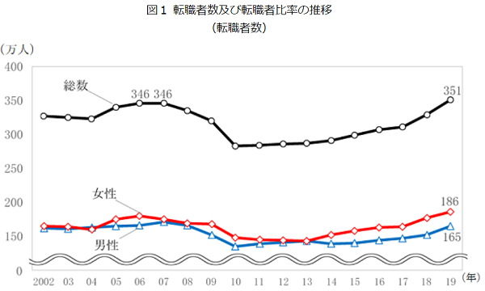

<head><link href="https://use.fontawesome.com/releases/v5.6.1/css/all.css" rel="stylesheet"></head>

 
 

## 本記事で伝えたいこと

 
 

転職には夢がある一方で失敗や後悔するリスクがつきまといます。

 

転職にはキャリアプランに則った「積極的な転職」と現職に対する不満を起因としている「消極的な転職」があります。
明確なキャリアプランがあるのであれば問題ありませんが、消極的な転職はなるべく避けるべきと考えます。

その点について本記事でご説明します。

 
 

## 転職の動向

 
 

皆さんは転職をしたことがありますでしょうか？

 

[総務省統計局の調査結果](https://www.stat.go.jp/data/roudou/topics/topi1230.html)によりますと、年間の転職者人数は約350万人（2019年）だそうです。

 
 

労働人口は約6000万人ですので、労働人口のうち約5%に相当する人数が転職していることになります。

意外にもここ20年程は転職者の人数は大きくは変わらず、年間300万人から350万人の間で推移していますが、近年は大企業や正規雇用者の転職が増えているようです。

 
 

終身雇用の崩壊が叫ばれる中で、転職を経験した方や、転職をしたことがなくても転職活動や転職の検討したことがある方は多いのではないでしょうか。

私も数年前に転職を経験しました。

 
 

## 現職よりも良い企業・職場は確実に存在する

 
 

日本の企業数は４００万社にもおよび、世の中には無数の仕事が存在することになります。

これだけの数ある中で、「現職の仕事がやりがいや待遇、適性の観点でベストである可能性」はほとんどゼロと言ってよいでしょう。

言い換えると、あなたにとって「今よりもやりがいがあり、待遇がよく、適性に合った仕事」は確実に存在します。

 
 

「転職してよりよい企業・職場に転身して行きたい」という考えもそういった意味で理にかなっていると言えます。

 
 

## 転職動機には２種類ある

 
 

主な転職動機として、以下の２種類があると言えます。

<li>積極的な転職（※）：キャリアプランを基にステップアップすることが目的</li>
<li>消極的な転職（※）：現職に対する不満や不安が動機</li>

※このような用語が一般的に存在するわけではなく、私が便宜上勝手に名付けました。

 

もちろん、両方の動機が同居しているケースも多いですが、どちらかが主な動機であることが多いでしょう。

例えば、明確にキャリアプランがあり、キャリアプランに従って転職する場合は「積極的な転職」と言えるでしょう。この場合ほとんどのケースで現在とは違う業界・職種への転職、あるいは日系企業から外資系企業への転職となります。

同業界かつ同職種の場合、キャリアを進めることにはならないからです。

 

一方で特に明確なキャリアプランが無いなかで転職をしたいと思っている場合は、ほとんどのケースで現職の待遇や環境など現状に何らかの不満を抱いています。

例えば、頑張っているのに評価されない、昇進の可能性が断たれた、人間関係がストレス、残業が多い、スキルが付かない、仕事が面白くない　など

また不満まで行かなくても、「このまま同じ環境に働き続けて大丈夫だろうか」「成長できない」といった現在の環境への不安感が転職の動機である方もいます。実際私がそうでした。

 
 

## 消極的な転職動機の場合は今一度考えなおした方がよい

 
 

転職動機が明確なキャリアプランから来ている場合は、転職をためらう理由はありません。

ただそうでない場合、今一度転職すべきか深く考えるべきです。

なぜならば転職には以下のようなデメリットも多いからです。

 
 

### 転職のデメリット

 
 

<i class="fa fa-check" style="color: #ff7f7f;"></i> 転職活動は心身のエネルギーを消費する

  経験したことのある人しかわからないと思いますが、転職活動は本当に大変です。特に現職で働きながらの転職活動は疲弊します。

 

  - 過去の業務や実績を振り返り職務経歴書や履歴書を作成

  - 転職サイトやエージェントから送られてくる多量の求人情報を精査

  - （応募した企業から書類落ちの通知を受け心を傷つけながら）なんとか通った企業の面接のために企業研究や志望動機等の説明の練習、各種質疑想定問答の準備

  - 現職の合間を縫い緊張しながら面接に赴き、１次面接で落とされた時はこれまでの社会人人生を否定されたような気になり

  - 幾度にもわたる面接をくぐり抜けてようやく内定をもらったら、現職の退職交渉に神経をすり減らす

  - 後ろ指をさされながら、申し訳ない思いを抱えながら、現職を後にする

     
     

<i class="fa fa-check" style="color: #ff7f7f;"></i> 転職先の業務業務プロセスを覚えたり、人間関係をイチから構築したり、苦労が多い

 

  転職してからも大変です。

  例え転職先が同じような業界や職種であっても、業務プロセスやそれに付随するシステムの使い方、情報/データの所在、などは企業ごとに異なり、覚えなくてはならないことが山ほどあります。

  これらをイチから覚えなくてはなりません。

  転職先では、ある意味「新人のようにモノが分からない状態」である一方、新人ではないのでなかなか同僚に甘えることはできません。

  また基本的には転職先の企業にほどんど知り合いはいませんので、人間関係もイチから構築する必要があります。

 
 

<i class="fa fa-check" style="color: #ff7f7f;"></i> 待遇や環境が改善するとは限らない

  現職に不満があって転職したのに、転職先に行っても変わらない、あるいはさらに状況が悪化する、という可能性も十分にあり得ます。

  給与や手当などは入社前に確認できますが、企業文化や人間関係、忙しさ、プレッシャーなど入社してみないとわかりません。

  苦労して転職しても状況が好転しないというリスクは十分にあります。

  また、最悪の場合、パワハラやセクハラなど精神を病んでしまうような環境である可能性もあります。

 
 

<i class="fa fa-check" style="color: #ff7f7f;"></i> 退職金が激減する場合あり

  確定給付型の退職金は転職者に不利なシステムとなっています。終身雇用前提のシステムのため、定年まで勤めあげた際に何千万円という退職金をもらえますが、途中で転職するとその額は非常に少なくなります。

 
 

現職に不満があるという理由で転職をするのはよいですが、上記のようなデメリットを十分に考慮した上で決断しているかを考えるべきです。

 
 

まずは現在の会社に残ったままで、不満・不安を解消する方法はないかを十分に検討すべきです。

 
 

### 転職以外の選択肢

 

<h4> 上司に相談し、別の職種・職場に異動させてもらう</h4>

  仕事内容に不満があるようでしたら、担当業務を変えてもらいましょう。

  勇気がいるかもしれませんが、転職するよりはよっぽどリスクは低いですし、慣れ親しんだ企業や部門に残れるので異動後の負担も転職に比べるとはるかに少ないケースが多いです。

 

<h4> 社内募集等で他部門へ異動</h4>

  その部門内では解決しないようでしたら、他部門へ社内募集で異動しましょう。

  ある程度の規模の会社でしたら、他部門へ異動する社内募集などの制度があると思います。

  部門が変わるとはいえ、同じ会社にとどまることができれば転職に比べると負担は軽くて済みます。

 

<h4> 副業を行う</h4>

  副業を行い、新しい経験・スキルや視野を広げてみると違う景色が見えるかもしれません。

  また、本業とは別の収入源があれば本業への依存度を下げ、精神的にゆとりを持つことができます。

 
 

## 同じ会社に勤め続けられるならそれが幸せ

 
 

転職が当たり前になってきており、さっそうと転職していく人がまぶしく見えることもありますが、私は同じ会社に勤め続けることができるのならばそれが幸せだと思っています。

転職によりエネルギー消費やストレスは大きいですし、転職にはリスクがつきものです。

文句を言いながらも、気の知れた同僚や慣れ親しんだ業務と長期にわたり（できれば定年まで）勤めることができるのも悪くない社会人生活ではないでしょうか。

 
 

## 転職せざるを得ない状況に備えて

 
 

終身雇用が崩壊し、希望したとしても同じ会社に定年まで勤められるかわからない時代です。

消極的な転職はなるべくすべきではない理由を説明してきましたが、一方で今後、民間企業に勤めている方は嫌でも転職せざるを得ない状況に置かれる可能性は十分にあります。

そのため、今すぐ転職しなかったとしても社外に目を向け、情報  収集を行う方が賢明です。

 

その１つの方法が転職はせずとも「転職活動」をしてみることです。

転職活動中に転職エージェントと会話したりするなかで、「世の中にどのような求人があるか」「自身の市場価値はどの程度か」について肌感覚でつかむことができます。

自身に十分な市場価値が無いと分かってきたら、スキルや業務経験値をアップし、市場価値を上げていくべきです。

また、転職活動の流れなどを一度経験・理解しておくことにより、いざ転職をせざるを得ない状況に置かれたときに、慌てずに取り掛かることができます。

 
 

## 【参考】転職して感じたメリット

 
 

ここまで消極的転職のデメリットを説明してきましたが、もちろん転職により得られるものもあります。

私は一度大手メーカーから大手メーカーに転職しました。

正直、上記で言うところの「消極的な転職」であったと思っています。

当時勤めていた大手メーカーで「これ以上頑張っても何も報われないなぁ。やる気起きない。どうせなら一度くらい転職してみようか。」といった感じで転職をしてしまいました。

大手メーカーという属性は変わらなかったため、共通していた部分も多かったですが、細かい業務プロセスの違いや人間関係の構築に苦労はしました。

 

それでも、以下のようなメリットはありました。

 
 

### 転職のメリット

 
 

<h4> 視野が広がる</h4>

  一つの企業しか経験していないと、業務内容やプロセス、問題点が一般的なものなのかその企業独自であるのか、判断がつきません。

  複数の企業を経験することにより、世の中の企業の実態を感覚としてつかむことができます。もちろん多種多様な企業があるなかで全体をつかむことはできませんが、「１社のも経験」と「２社経験」では全く異なります。

 

<h4> 企業への執着が減る</h4>

  １社に長く勤務していると、その企業は人生になくてはならないもののように感じますが、転職をすると特定の企業への執着が減ります。

  実際に再度転職するか・転職できるかは置いておいて、所属する企業に執着しすぎなくなります。

 
 
 