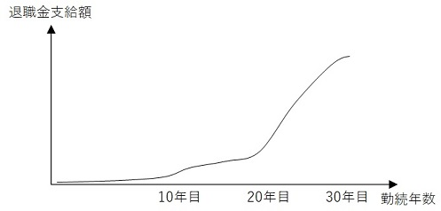
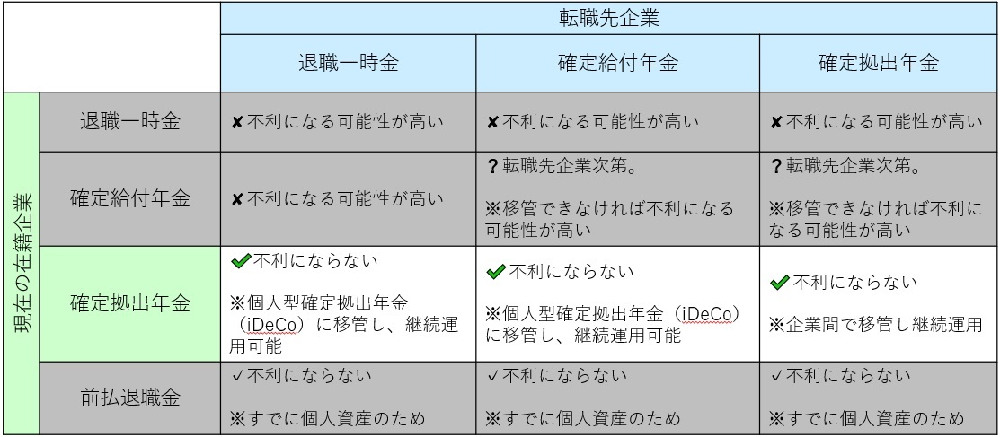

<head><link href="https://use.fontawesome.com/releases/v5.6.1/css/all.css" rel="stylesheet"></head>

 
 

退職金や年金について詳しく理解している方は少ないのではないでしょうか。

 

特に「定年退職」が遠い未来である若者は、退職金や年金について無頓着であったり、「年金なんてどうせもらえない」といったあきらめの境地にいる方も多いかと思います。

 

実際、退職金や年金に関して、普段から考えなくてはならないことはほとんどないのですが、様々な人生の節目においては、それらの理解をしておくべきタイミングがあります。

その一つが転職です。

 

「転職すると退職金が少なくなる」「退職金制度は転職者に不利」と言われることがあります。

結論から言いますと、これは一般論としては正しいです。

ただ、どうして不利なのか、どのくらいの額を損するのか、しっかりと理解している人は少ないように感じます。

 
 

## 本記事で伝えたいこと

 
 

会社員にとっての退職金や年金制度をわかりやすく咀嚼した上で、転職時に退職金や年金が不利になるのかどうか、について解説します。

※対象は民間企業に勤める会社員です。また、近年の動向について扱っており、比較的新しい制度・動向にフォーカスを当てています。そのため過去の制度について説明が無いものがあるかと思いますがご容赦ください。

 
 

## 退職金と年金は共に定年後の生活を支えるための制度

 
 

退職金と年金を全く別のものと考えている方もいるかもしれません。

それはある意味で正しいですが、

「定年後の生活を支えるための制度である」という本質的な意味で、年金と退職金は一括りで考えるべきです。

 
 

#### 退職金とは

退職金は、退職時に一括して「各企業にて設定された計算式」を基に算出・支給されます。

退職金の計算式は一般的には、勤続年数や給与、役職等を基に定義されます。

定年退職時だけでなく、転職などの中途退職時にも退職金は支払われます。

 
 

#### 年金とは

一方で年金は定年退職後（厚生年金は2020年時点で65歳から）に月々一定額が支払われます。

会社員の年金は3階建て構成であり、下から「１階：国民年金」「２階：厚生年金」「３階：企業年金」で構成されます。

 

図① 会社員の年金構成イメージ（自営業や公務員の部分は省略）

 
 

1階、2階部分の国民年金と厚生年金は、公的年金と呼ばれ国が管理します。

公的年金としては、会社員は厚生年金に加入します（厚生年金に加入すると自動的に国民年金にも加入）し、会社員の配偶者（扶養内）は国民年金に加入します。

 

３階部分の企業年金は私的年金であり、企業が管理します。

企業年金はいくつか種類があり、退職金との関係もややこしいので、わかりづらさの要因となっています。

 
 

## 退職金と年金を理解する

 
 

### 「公的年金」と「退職金/企業年金」を分けて考える

まずは「公的年金（国民年金/厚生年金）」と「退職金/企業年金」を２グループに区別して考えるのが、理解の近道です。

 
 

#### 公的年金（国民年金/厚生年金）

 

公的年金である「国民年金と厚生年金」は、上の図①の通り、年金3階建てのうち1階と2階に位置します。

会社員は公的年金として厚生年金に加入します（同時に国民年金にも加入することになります）。厚生年金は所属する企業にかかわらず同一の制度が適用されます。

以下表①は国民年金と厚生年金の平均支給額です。

 

表① 国民年金と厚生年金の平均支給額 （引用元: <a href="https://www.nenkin.go.jp/oshirase/topics/2020/20200401.html">令和2年4月分からの年金額等について - 日本年金機構</a>）

 
 

#### 退職金/企業年金

 

一方で、退職金と企業年金は3階に当たります。

公的年金である国民年金や厚生年金は国が管理しており所属企業が変わっても影響ありませんが、私的年金である企業年金は企業ごとに採用する制度が異なるため転職による影響があります。

 
 

※退職金は厳密には年金制度ではないですがわかりやすさのため年金制度の3階に位置づけています。

 
 

以下、転職時に影響を受ける退職金や企業年金に関して解説していきます。

 
 

### 退職金と企業年金の境界はあいまい

 
 

近年、退職金と企業年金の位置づけはあいまいになってきています。

退職金も企業年金も「（退職時や退職後に）公的年金とは別に企業から支給されるお金」という意味では同じだからです。

そして、各企業が退職金や企業年金制度のうちどの制度を採用するか独自に決定する仕組みである点も、あいまいさの要因となっています。

 

退職金や企業年金制度の比較表を以下に作成しました。

表② 各退職金/年金制度の比較

<table border="1">
<thead style="background-color:#e6e6fa">
<tr>
<th></th><th>退職一時金</th><th>確定給付企業年金</th><th>確定拠出企業年金</th><th>前払退職金</th>  
</tr>
</thead>

<tr>
<td style="text-align:center;">概要</td><td>いわゆる退職金</td><td>支給額が事前確定</td><td>支給額が運用結果次第</td><td>退職金を退職前に支給</td>
</tr>

<tr>                     
<td style="text-align:center;">支給方法</td><td>一括</td><td>「一括 or 月々」を選択可</td><td>「一括 or 月々」を選択可</td><td>給与に上乗せし月々支給</td> 
</tr>

<tr>
<td style="text-align:center;">支給タイミング</td><td>定年退職または中途退職</td><td>一括：定年退職または中途退職 月々：定年退職後</td><td>一括：定年退職 月々：定年退職後</td><td>在職中に月々支給</td>
</tr>
    
<tr>
<td style="text-align:center;">支給額</td><td>企業独自の計算式で算出</td><td>企業独自の計算式で算出</td><td>掛け金の運用成績次第</td><td>確定拠出企業年金と同額</td>
</tr>

<tr>
<td style="text-align:center;">掛け金の拠出額</td><td>各企業独自</td><td>支給額と予定利率を基に決定</td><td>固定額を拠出</td><td>掛け金無し （現役従業員に直接支給）</td>
</tr>

<tr>
<td style="text-align:center;">資産運用主体</td><td>各企業</td><td>各企業に委任された金融機関 （生命保険会社、信託銀行など）</td><td>運用メニューから選択</td><td>従業員が自由に使用</td>
</tr>

<tr>
<td style="text-align:center;">ポータビリティ</td><td>無し （転職時に退職金として支給）</td><td>ケースバイケース （転職先企業次第）</td><td>有り （転職先やiDeCoに移管）</td> <td> ー </td>
</tr>
</table>

 

 
 

いわゆる「退職金」は退職一時金という企業個別の制度であり、「企業年金」は複数の制度が存在します。

以下、個別に説明します。

 
 
 

#### 退職一時金

 

私たちがイメージしている「退職金（退職時に一括で支給）」の給付制度です。

企業が独自のルールで支給額を計算・一括支給します。

支給額は勤続年数や給与、役職などにより計算され、一般的に浅い勤続年数（20年未満など）で退職すると不利になる仕組みになっています（下図はイメージ）。

 

 
 

「転職すると退職金が少なくなる」「退職金制度は転職者に不利」と言われる所以はここにあります。

 
 
 

#### 確定給付企業年金

 

退職一時金制度と違い、「専門の金融機関を使い、拠出した掛け金を元に資産運用する」する年金制度です。

年金受給額は、企業独自のルール（勤続年数、給与、役職　等）を基に約束されています。

企業によりますが、一般的に支給方法は「一括」と「月々払い」を受給者が選択できます。

退職一時金制度と違い、金融機関（信託銀行や生命保険会社）が「企業が拠出する掛け金」を運用します。

その際に、「企業が拠出する掛け金」は「金融機関と合意する予定金利」と予定支給額を基によって決定されます。ざっくり言いますと、高運用金利を期待できるときは企業が払う掛け金が低くて済みますが、低運用金利の時は掛け金が高くなります。

 
 
 

#### 確定拠出企業年金

 

「（企業が）掛け金を提供するので、従業員が自分で運用しなさい」という年金制度です。

年金受給額は未確定であり、従業員自身の運用成果に応じて受給額が上下します。そのため、（確定給付企業年金と違い）企業側は運用リスクを負いません。

従業員は、信託銀行などの金融機関が用意する複数メニューから資産運用商品を選択します。

通常、「国債などを中心とした低リスク・低リターン運用」から「株式中心の高リスク・高リターン運用」まで複数の運用メニューが用意されています。

 
 
 

#### 前払退職金

 

「在職中に支給してほしいならば、月々の給与や賞与に上乗せして支給するよ」という制度です。

通常、確定拠出企業年金制度を導入した企業は従業員に対して『確定拠出企業年金の拠出金相当額を給料上乗せで支給するという選択肢』を与えます。

「確定拠出企業年金 or 前払退職金」の選択肢になりますので、前払退職金を選んだら退職時・退職後に確定拠出企業年金は支給されません。

給与に上乗せされた「前払退職金」は、もちろん受給者が自由に消費・貯蓄・運用することができます。

自由度がある一方で、給与や賞与に上乗せされるため所得税、住民税、社会保険料が発生するというデメリットもあります。

 
 

## 転職時の退職金や年金への影響

 
 

転職すると、「退職金や年金にどのような影響があるのか」「不利になるのか」が気になる点だと思います。

 

その観点では、「現在の企業と転職先企業が、それぞれどの退職金/年金制度を採用しているか」がポイントとなります。

なぜならば、<b>「現在の企業が運用している私達の資産」をそのまま転職先企業へ移管できるかどうか</b>、によって退職金/年金への影響有無が概ね決まるからです。

 
 

### 企業が積み立てている退職金や年金は転職先企業に移管できるか？

 
 

では、それぞれの退職金や企業年金制度が、<b>積立退職金/年金資産を企業間の持ち運び</b>を可能としているか、見てみましょう。

 
 

#### 退職一時金

 

各企業独自基準で退職金が支払われるため、企業間の移管はできません。

転職に伴う在籍企業からの退職時に退職一時金が一括で支払われます。

 
 

#### 確定給付企業年金

 

転職先企業次第です。

転職先企業が確定給付企業年金を採用している場合は移管できる可能性があります。

また、確定拠出企業年金の場合でも移管できる可能性があります。

転職先に移管できない場合、退職一時金と同様、在籍企業を退職する時に一括支給（清算）されます。

 
 

#### 確定拠出企業年金

 

移管可能です。というより移管しないといけません。

企業間の移管を前提としている制度であり、転職先企業への資産の移管が前提となります。

もし転職先企業が確定拠出企業年金を採用していない、または自営業や主婦/主夫になる場合は、個人型確定拠出企業年金（iDeCo）への移管が可能です。

逆に確定拠出企業年金を解約して一時金として受け取るのはハードルが非常に高く、現実的ではないです ([参考: 確定拠出企業年金は解約できるの？　必要な手続きとメリット・デメリット](https://www.resona-tb.co.jp/401k/begin/cancel-contract.html))。

 
 

#### 前払退職金

 

在職時に従業員個人に給与と一緒に支給してしまうため企業が預かっている資産がなく、そもそも移管する資産はありません。

 
 
 

### 転職時に退職金/企業年金が不利になる場合とならない場合

 
 

転職時に退職金や企業年金が不利になるかどうかは、基本的には積立資産を転職先の企業に移管できるか次第です。

それを元に、今の企業と転職先企業の制度の組み合わせごとの退職金/年金への影響を以下の表に示しました。

 

 
 
 

以下、一つ一つ見ていきましょう。

 
 

✘ 現在の企業が退職一時金制度を採用

転職すると支給額が不利になる可能性が高いです。

退職一時金は、各企業独自の制度であり転職先企業に移管できず、退職時（転職時）に退職一時金として清算・支給されます。

多くの企業で、退職一時金の算出計算式は、勤続年数が浅い（20年未満など）と非常に不利にできています。

そのため、本制度を採用している企業から勤続年数20年以内で退職すると、支給額が不利になります。

 
 

 
 

勤続年数に対する退職一時金支給額のイメージ

 
 
 
 

? 現在の企業が確定給付企業年金を採用

転職すると支給額が不利になる可能性が高いです。但し転職先企業によっては不利にならない可能性もあります。

転職先企業が確定給付企業年金または確定拠出企業年金を採用しており、転職元企業からの確定給付企業年金の移管を受け入れている場合は、不利にならない可能性があります。

そうでない場合は退職一時金制度と同様、勤続年数が浅い段階での転職は不利となります。

 
 

 
 
 
 

<i class="fa fa-check"></i> 現在の企業が確定拠出企業年金を採用

転職しても支給額が不利にならないです。

転職先企業が確定拠出企業年金を採用していれば、転職しても支給額は減りません。

転職元の企業が確定拠出企業年金を採用している場合、転職しても資産額や退職時の支給額に影響はありません。

確定拠出企業年金で運用している資産を企業間でそのまま移管可能だからです。

※選択できる運用メニューも、移管先で同一・同様のメニューが用意されていることがほとんどです。

もし、転職先企業が確定拠出企業年金を採用していない場合は、個人型確定拠出企業年金（iDeCo）に移管することができるので、これまで確定拠出企業年金で積み立てた資産を継続して運用することが可能です。

 
 

 
 
 
 

### 具体的なケース（私が転職した際）

 
 

私が転職した際は、転職元の企業に確定給付企業年金と確定拠出企業年金双方の資産がありました。

新卒入社時点では、確定給付企業年金でしたが途中で確定拠出企業年金に切り替わったため、積立資産は確定給付企業年金と確定拠出企業年金双方に残っていたためです。

転職先企業は、確定拠出企業年金のみを採用していましたので、確定拠出企業年金積立分を移管し、確定給付企業年金分は退職金として一括で受け取りました（勤続年数が10年程度だったため、額が非常に少なくがっかりしました…）。

 
 

このように時代の移り変わりとともに、企業が採用する退職金/年金制度は変更されてきており、複数の企業年金制度が併用されているケースもあります。

 
 

## 近年の動向

 
 

近年、企業による確定拠出企業年金の採用が増えています。

これまで退職一時金や確定給付企業年金が主流でしたが、2001年に確定拠出企業年金法が施行されて以降、徐々に確定拠出企業年金を採用する企業が増えてきました。

最近は、富士通やパナソニック、ソニーなど大手企業による確定拠出企業年金の採用も進んでいます。

バブル崩壊後の超低金利相場において従来想定していた確定給付企業年金での運用益が期待できないなか、不景気時の運用難による含み損を回避するために、「給付額を約束する必要が無い確定拠出企業年金」を企業が好んでいるという事情が背景にあります。

 
 

これは言わば、「企業年金の運用リスクを企業から従業員に転換する」と同義です。

私達自身が企業年金の運用方法を慎重に選び、定年退職後の生活資金を確保することが求められています。

 
 

## まとめ

 
 

定年退職後の生活資金を支えるための退職金/年金制度は一見わかりづらいですが、公的年金である国民年金や厚生年金をベースとして、その上に退職金や企業年金が用意されていると覚えましょう。

 

退職金や企業年金は、各企業が独自に選択するものですので、企業によって採用されている制度は異なります。

退職一時金、確定給付企業年金、確定拠出企業年金など自社や転職先企業が採用している制度を確認し、転職時のこれらに対する影響を確認しましょう。

 
 

確定拠出企業年金を採用している場合は、転職時に企業間で移管できるのでマイナス影響はありません。

一方で退職一時金や確定給付企業年金を転職先企業に移管できない場合は、勤続年数が短いと退職金や年金が不利になるケースが多いです。

 

退職金や企業年金に対する影響を考えて転職するしないを決める時代ではなくなってきていますが、将来の生活に影響する事柄ですので、ぜひ退職金や企業年金について理解を深めておきましょう。

 
 

