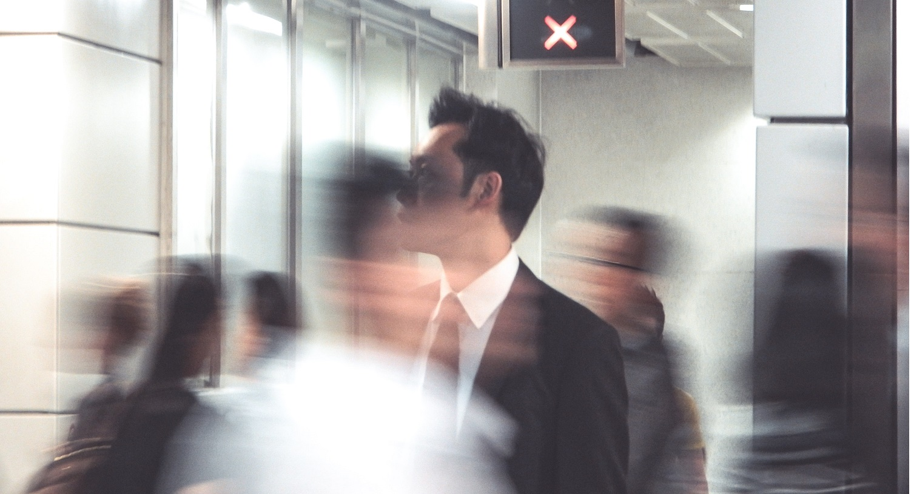
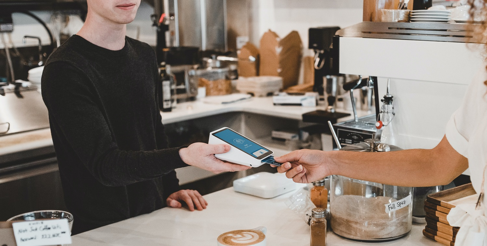

<head><link href="https://use.fontawesome.com/releases/v5.6.1/css/all.css" rel="stylesheet"></head>

 
 

現在（2021年時点）はコロナ渦のため海外出張をする人は稀だと思いますが、コロナ渦終息後には海外出張を久しぶりに再開したり、もともと海外出張に慣れていない方が海外出張をする機会も出てくると思います。

私はこれまで５０回以上ヨーロッパ、アメリカやオセアニアの海外出張を経験しています。

それらの経験をもとに海外出張のコツや注意点をシーン別にまとめてみました。

<b>【目次】</b>
<!-- TOC -->

- [海外出張のコツ・注意点](#海外出張のコツ・注意点)
    - [空港・フライト](#空港・フライト)
        - [空港には余裕を持って到着する](#空港には余裕を持って到着する)
        - [長時間フライトの場合はリラックスできる服装で行く](#長時間フライトの場合はリラックスできる服装で行く)
        - [時計や指輪も外しておく。パソコンや液体類は取り出しやすい場所に入れる。](#時計や指輪も外しておくパソコンや液体類は取り出しやすい場所に入れる)
        - [ロストバッゲージ（預け荷物の紛失）に備え、一日分の必需品を手荷物に入れる](#ロストバッゲージ預け荷物の紛失に備え一日分の必需品を手荷物に入れる)
        - [パスポート、航空券入れを使う](#パスポート航空券入れを使う)
        - [フライトの座席は好みに応じてしっかり選ぶ](#フライトの座席は好みに応じてしっかり選ぶ)
        - [入国審査](#入国審査)
        - [仕事用の「サンプル商品」をハンドキャリーする場合の注意](#仕事用のサンプル商品をハンドキャリーする場合の注意)
    - [時差ぼけ](#時差ぼけ)
        - [飛行機に乗ったら腕時計を現地時間に合わせる](#飛行機に乗ったら腕時計を現地時間に合わせる)
        - [飛行機で寝るべきかどうかはその人次第](#飛行機で寝るべきかどうかはその人次第)
        - [現地についたら日の光を浴びる](#現地についたら日の光を浴びる)
        - [睡眠薬や睡眠導入剤の使用もあり](#睡眠薬や睡眠導入剤の使用もあり)
    - [ホテル](#ホテル)
        - [交通の便が良いホテルを選ぶ](#交通の便が良いホテルを選ぶ)
        - [必要最低限だけスーツケースから取り出す](#必要最低限だけスーツケースから取り出す)
        - [洗面用具は持参する](#洗面用具は持参する)
        - [チェックアウトする時は指さし確認](#チェックアウトする時は指さし確認)
        - [USB付きのコンセントは便利](#usb付きのコンセントは便利)
        - [使用済み服入れ](#使用済み服入れ)
        - [コンセント変換プラグは出張バックに入れておく](#コンセント変換プラグは出張バックに入れておく)
    - [仕事](#仕事)
        - [英語の名刺](#英語の名刺)
        - [ドレスコードを確認する](#ドレスコードを確認する)
        - [国際携帯電話やWifiルーターを準備](#国際携帯電話やwifiルーターを準備)
        - [VPN設定準備](#vpn設定準備)
    - [移動時](#移動時)
    - [その他](#その他)
        - [クレジットカードはVisaやMastercardを最低２枚持参する](#クレジットカードはvisaやmastercardを最低２枚持参する)
        - [一定額の現地通貨は日本で用意する](#一定額の現地通貨は日本で用意する)
- [まとめ](#まとめ)

<!-- /TOC -->

 
 

## 海外出張のコツ・注意点

 
 

空港やフライトは慣れない人にとっては、気力や体力を消耗してしまいます。

事前に準備をしておくことにより、リラックスして行動できるようにしましょう。

 
 

### 空港・フライト

 
 

 
 

#### 空港には余裕を持って到着する

 
 

基本中の基本ですが、空港には「フライト出発時間の２時間前」には到着するようにしましょう。

通常、２時間前に空港に到着すると時間を持て余すことになりますが、まれにチェックインカウンターやセキュリティチェック（手荷物検査）が混雑しており、搭乗口にたどり着くまでに予想外に時間がかかることがあります。

また外資系航空会社の場合、チェックインの締め切りが日系航空会社よりも早く、フライト時間の1時間半前にチェックインが締め切られる場合があります（ANAやJALはフライト時間の1時間前にチェックイン締め切り）。

空港までの公共交通が乱れる可能性なども踏まえ、余裕を持って空港に到着しましょう。

空港には土産物屋、レストランやカフェ、ラウンジ（通常、ラウンジを利用できるのは権利保有者のみ）など時間をつぶす場所はたくさんありますので、早く空港に到着しても損はないと思います。

 
 

#### 長時間フライトの場合はリラックスできる服装で行く

 
 

特に10時間を超えるような長時間フライトの場合は、ビジネススーツやカッチリした服装ではなく、可能であればジャージなどリラックスできる服装にしましょう。

ただでさえ海外出張は体力を消耗しますので、長時間のフライトで現地に着く前に疲れてしまわないように、リラックスできる服装のほうがよいでしょう。

また、空港のセキュリティチェック（手荷物検査）ではベルトを外す必要があります。セキュリティチェックは上着を脱いだりパソコンなどをバッグから出したりと非常に慌ただしく、そういった中でベルトを外す必要が無いようにベルトせずに済む服装が望ましいです。

出張初日が移動日の場合は、リラックスできる服装で家を出ましょう。

 
 

#### 時計や指輪も外しておく。パソコンや液体類は取り出しやすい場所に入れる。

 
 

セキュリティチェック（手荷物検査）では時計や指輪も外す必要がある場合が多いです。慌ただしく時計や指輪を急いで外すのは大変ですし、紛失する恐れもあります。

事前に小物入れなどにしまっておき、セキュリティチェックを通過してから身に着けましょう。

また、パソコンや液体類はバッグから取り出して分けてトレーに置く必要がありますので、セキュリティチェックは慌ただしいので、トレーに取り分ける必要があるものはバッグの取り出しやすい位置に入れておきましょう。

セキュリティチェックではモノを紛失しがちです。私も過去にパソコンや指輪を紛失したことがあります。

セキュリティチェック後は、トレーに置いたバッグや物を忘れないように注意しましょう。

 
 

#### ロストバッゲージ（預け荷物の紛失）に備え、一日分の必需品を手荷物に入れる

 
 

稀にですが、預け荷物（チェックイン時に預けるスーツケース等）が紛失してしまったり（英語を略して「ロスバケ」とも呼びます）、別の便で遅れて到着することがあります。

ロストバッゲージに備えて、最低1日は生活できるように手荷物に下着や生活必需品は備えておきましょう。また貴重品は必ず身に着けたり、手荷物に入れましょう。

 
 

#### パスポート、航空券入れを使う

 
 

パスポートや航空券は普段持ち歩かないものなので、ポケットにいれると無くしてしまう恐れがあります。かといってバッグに入れておくと、いちいち取り出すのが面倒です。

少しかっこ悪いですが、首からぶら下げるパスポート入れを持ち歩くと便利です。

 
 

#### フライトの座席は好みに応じてしっかり選ぶ

 
 

長時間フライトでは座席位置が重要です。

もし、誰にも邪魔されずにゆっくり寝たい場合は、窓側の席が最適です。

一方で、トイレに行くときに隣の人に気を使いたくない場合は通路側がおすすめです。ジャンボジェットの場合は真ん中４列の端の席が一番おすすめです。

 
 

#### 入国審査

 
 

目的地の空港につくと、入国審査で審査官より質問を受けます。

入国の目的や目的地、宿泊先などを聞かれますので、不安であれば、あらかじめ紙に回答内容を書いておき、スムーズに応対できるようにしましょう。

 
 

#### 仕事用の「サンプル商品」をハンドキャリーする場合の注意

 
 

サンプル商品（パソコン、スマホ、家電など）を海外に持ち込むときには、「仕事で必要なサンプル商品である旨」を記載したインボイスを作成・持参しましょう。

商品を販売するために海外に持ち込む場合は、関税を支払わなくてはならないことがあります。そのため、インボイス無しでサンプル商品を持ち込もうとすると、税関の抜き打ち検査に引っ掛かり高額の罰金を科されることがあります。

私自身、現地販売会社が評価するためのタブレット端末をドイツの持ち込もうとした際に、インボイスを忘れてしまい、運悪くドイツの税関に尋問を数時間受け、その後5万円程度の罰金を科されました。

また万が一に備え、インボイスだけでなく、「Sample」と書いたテープをサンプル商品に貼ったり、商用の箱には入れないなどの工夫をして、販売用の商品と勘違いされないように注意しましょう。

 
 

### 時差ぼけ

 
 

 
 

時差ぼけは多くの方にとって「海外出張時の大きな悩み」の１つだと思います。

時差ぼけが無い人もまれにいますが、私の経験上多くの方は時差ぼけが解消するまでに最低1週間はかかります。

時差ぼけにうまく対応できるかどうかで、出張時のパフォーマンスが変わってきますので、時差ぼけをなるべく緩和するための工夫は重要です。

 
 

#### 飛行機に乗ったら腕時計を現地時間に合わせる

 
 

飛行機に搭乗したら、すぐに腕時計の時刻を訪問する国の現地時間に設定しましょう。

そうすることにより、訪問先の時刻に意識を合わせ、心や体の準備をすることができます。

また、現地到着時に腕時計の時刻変更忘れにより慌てるといったこともなくなります。

 
 

#### 飛行機で寝るべきかどうかはその人次第

 
 

ヨーロッパやアメリカに出張すると、機内で「日本時間の夜中」を過ごすことになります。

その際に「眠気に任せて寝るか」あるいは「頑張って起き続けるか」の選択に迫られます。

「眠いときに眠る派」と「頑張って起きてる派」に分かれますが、この選択は、個々人の考え方によって決まります。

私は睡眠時間をなるべく現地時間に合わせるために、機内では頑張って起きておき、現地時間の夜遅くにホテルで寝ることが多いですが、それでもホテルでも少ししか眠れないこともあり、そういった場合は次の日の体調が最悪です。

そのリスクを避けるために「機内でも眠れるときに眠る」という考え方もありだと思います。

 
 

#### 現地についたら日の光を浴びる

 
 

ヨーロッパやアメリカなど時差の大きい国に到着しホテルにチェックインした後で、長旅の疲れからそのまま部屋でくつろぎたい気持ちになりますが、もし太陽が出ているようであれば日光を浴びに外に出たほうがよいです。

日光を浴びると体が目覚め、現地時間に体内時計を合わせやすくなるからです。

また、ホテルの部屋にいると早い時間から眠ってしまい、夜中に眠れなくなってしまいます。

 
 

#### 睡眠薬や睡眠導入剤の使用もあり

 
 

睡眠薬に頼ることについては賛否あるかと思いますが、私は使用するのもありだと思っています。

睡眠不足の中、体に鞭を打って体や精神に負担をかけるよりも、薬でぐっすり眠り疲れをとった方が良いとも言えるからです。

必要であれば、病院で事情を説明して睡眠薬や睡眠導入剤を処方してもらいましょう。

 
 

### ホテル

 
 

 
 

#### 交通の便が良いホテルを選ぶ

 
 

繰り返しですが、海外出張中は体も精神も消耗します。

そのため、なるべく効率的かつ楽に行動できるホテルを選びましょう。

例えば、夜遅くに到着する便ならば空港内のホテルを予約したり、到着日に時間に余裕がありそうであれば、次の日の待ち合わせ場所のなるべく近辺のホテルをおさえると良いです。

出張前に日本で現地の地図を眺めている際は「大丈夫だろう」と思いがちですが、実際に現地に行ってみるとホテルの場所次第で、苦労したりあるいは助けられたりすることが往々にしてあります。

 
 

#### 必要最低限だけスーツケースから取り出す

 
 

ホテルの部屋では、必要最低限のモノのみをスーツケースから取り出しましょう。

不必要にいろいろなモノを部屋のあちこちに置いてしまうと、チェックアウト時のパッキングに時間がかかりますし、忘れ物につながります。

 
 

#### 洗面用具は持参する

 
 

海外のホテルには日本のホテルのように歯ブラシや髭剃り、櫛などのアメニティが置いていないことが多いです。

最低限のシャンプー、ボディーソープ、ドライヤーはありますが、それ以外は基本的に自分で持参する必要があります。

備え付けシャンプーも髪に合わなかったり、硬水で髪の毛がギシギシしてしまう可能性があるので、日本から旅行用のシャンプーセットを持っていくと安心です。

歯ブラシや髭剃り、櫛などの洗面グッズを入れる専用バッグが便利です。洗面台があまり広くなかったり、モノが散らかってしまったりするからです。

フックが付いているバッグだと、バスルームの適当なところに引っ掛けて上から垂らして使えるので、洗面台がちらからずに快適に使えるので、おすすめです。

 
 

#### チェックアウトする時は指さし確認

 
 

チェックアウト時に慌てているとモノを忘れてしまうことがあります。

なるべく、部屋中を指さし確認して忘れ物が無いように確認しましょう。

 
 

#### USB付きのコンセントは便利

 
 

海外出張では通常、パソコンやタブレット、スマホなど多数の電子機器を持参します。

ホテルではこれら多数の電子機器を同時に充電する必要があるので、USB充電機能付きの電源タップを持参すると便利です。

 
 

#### 使用済み服入れ

 
 

海外出張に限らないですが、使用済みの服を入れるビニール袋を持参すると未使用の衣類と混ざらないので便利です。

 
 

#### コンセント変換プラグは出張バックに入れておく

 
 

外国では、日本とは形状の異なる電源コンセントであることが多いです。

よく訪問する国のコンセント変換プラグをあらかじめ出張用バックに忍ばしておくと忘れないので安心です。

 
 

### 仕事

 
 

 
 

海外出張は現地で仕事をすることが目的ですので、抜かりないように準備が必要です。

 
 

#### 英語の名刺

 
 

海外の取引先やパートナーなどと会う場合は、英語の名刺を用意・持参しましょう。

海外では、日本のように必ず名刺交換を行う文化はありませんが、海外の方の名前は覚えづらかったり、役職や連絡先の情報も入手できるので、英語の名刺を用意して、名刺交換できるようにしましょう。

ちなみに、欧米では日本のように「会っていきなり名刺交換する」ことはありません。会議終了後に、興味を持った相手と交換するのが普通ですので、必ず名刺交換する必要はありません。

 
 

#### ドレスコードを確認する

 
 

ビジネススーツが必須であったのは過去の話で、海外でもビジネスカジュアルスタイルで問題ないケースが増えてきています。

とはいえ、訪問する国のビジネス文化やミーティングの内容にもよりますので、事前にドレスコードを確認しましょう。

 
 

#### 国際携帯電話やWifiルーターを準備

 
 

国際携帯電話やWifiルーターは必須アイテムです。日本でレンタルできるので、事前にレンタルして持参しましょう。

Wifiルーターは定額が基本ですが、国際携帯電話は使いすぎると利用料が高額になるので、通話料を事前にチェックしておき、通話時間には注意するようにしましょう。

 
 

#### VPN設定準備

 
 

海外出張中ににメールなど社内ネットワークにパソコンを接続する必要があるケースが多いと思います。

事前にVPN経由で社内ネットワークにアクセスできるように準備・確認しましょう。

 
 

### 移動時

 
 

 
 

交通手段の事前確認は重要です。

特に海外の慣れない土地では、調べたり人に聞くことが言語の問題で難しい場合があります。余裕を持って行動できるように、交通手段は事前に調査しておきましょう。

上にも書いてますが、できれば待ち合わせ場所に近いホテルが望ましいです。地図でみると近く見えますが実際に訪問すると遠かったり、交通手段が複雑であったりと困ってしまうことが往々にしてあるからです。

 
 

### その他

 
 

 
 

#### クレジットカードはVisaやMastercardを最低２枚持参する

 
 

海外出張時の支払いはクレジットカードが便利です。

但し注意点は、日本ではメジャーなJCBが使えなかったり、クレジットカードが一枚しかないとホテルなどの高額な支払いにより支払い可能上限額をオーバーしてしまうことがあります。

そのため、VisaやMastercardのクレジットカードを最低２枚持参すると安心です。

 
 

#### 一定額の現地通貨は日本で用意する

 
 

よっぽどの発展途上国でない限り、海外でも問題なくクレジットカードを使うことができます。

ただ、稀にクレジットカード支払いがNGなケースもあります。

例えば、空港からホテルに向かうタクシーがクレジットカードNGなケースもあるので、到着して早々慌てないように、念のために一定額（日本円にして1万円など）の現地通貨をあらかじめ日本で用意しておくと安心です。

 
 

## まとめ

 
 

いかがでしたでしょうか。

慣れない海外出張は、心身ともに非常に消耗します。また予期せぬハプニングが発生しがちです。

なるべく、心身に負担をかけずまた安心して仕事に打ち込めるように、上記の点を参考に海外主張の準備をしてみてはいかがでしょうか。

 
 

