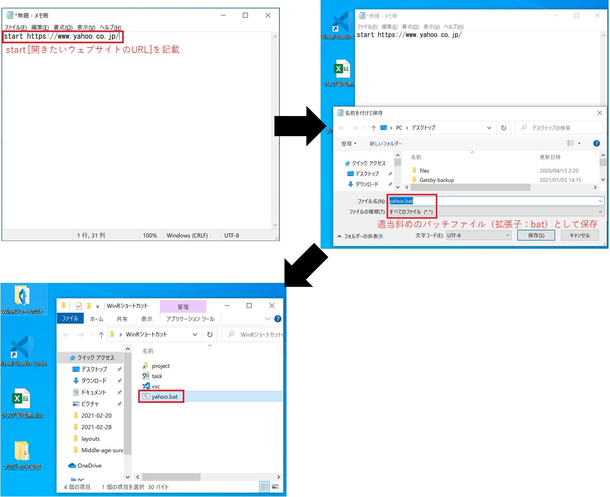

<head><link href="https://use.fontawesome.com/releases/v5.6.1/css/all.css" rel="stylesheet"></head>

 
 

仕事が定時で終わらず残業続きで困っている方、もっと仕事効率を上げたい方など向けに、パソコン操作効率化のコツについてご紹介します。

<b>【目次】</b>
<!-- TOC -->

- [パソコン操作術を学ぶメリット](#パソコン操作術を学ぶメリット)
- [[Windows]キー＋[R]キーのコマンドの活用術](#windowsキー＋rキーのコマンドの活用術)
    - [[Windows]キー＋[R]キーのコマンド活用とは？](#windowsキー＋rキーのコマンド活用とは)
    - [活用方法① アプリの起動](#活用方法①-アプリの起動)
        - [デフォルトで起動できるアプリ](#デフォルトで起動できるアプリ)
        - [その他のアプリをWindowsキー＋Rで起動したい場合](#その他のアプリをwindowsキー＋rで起動したい場合)
    - [活用方法② よく使うファイル・フォルダへのアクセス](#活用方法②-よく使うファイル・フォルダへのアクセス)
    - [活用方法③ よく使うウェブサイトへのアクセス](#活用方法③-よく使うウェブサイトへのアクセス)
- [まとめ](#まとめ)

<!-- /TOC -->

 
 

## パソコン操作術を学ぶメリット

 
 

 
  

多くのオフィスワーカーの方が、仕事において多くの作業にパソコンを使っていると思います。

「メールの送受信」「チャットツールでコミュニケーション」「ブラウザーで調べ物」「パワーポイントで資料作成」「エクセルで進捗管理」「CADで図面を描く」「システムで各種申請」など多岐に渡る作業がパソコンで行われています。

一昔前に比べるとパソコンの性能は大幅に上がり、様々な仕事がパソコンをはじめとするITシステムに支援され仕事が効率化されているのは確かです。

ただ一方で、パソコン操作がボトルネックとなり、仕事の効率がいまいち上がらない方もいると思います。

逆に言いますと、パソコン操作の効率化・スピードアップができれば、それだけ仕事効率が上がり、常態化した残業から解放されたり、「考えること」により多くの時間を割くことができるようになります。

また、パソコン操作には心身共に疲労が伴います。そのため、パソコン操作を効率化することで、無駄な疲労を避けることもできます。

 

パソコン操作効率化の方法として、「タッチタイピング」「ショートカットキー活用」など様々なものがありますが、これらについては多くの方がすでに実践していたり、また多くの参考記事が既に存在します。

そこで、本記事では意外とまだあまり知られていない、うまく活用されていない『Windowsキー＋Rキー』の賢い利用方法を紹介します（Windowsパソコンを使用している方向け）。

 
 

## [Windows]キー＋[R]キーのコマンドの活用術

 
 
 

### [Windows]キー＋[R]キーのコマンド活用とは？

 
 

Windowパソコンの左下に窓の形をした[Windows]キーがあり、この[Windows]キーと[R]キーを同時に押すと、「ファイル名を指定して実行」というウィンドウが現れます。

「ファイル名を指定して実行」ウィンドウの入力欄にコマンドを入力し「OK」ボタンを押すと、様々な操作をショートカットで実行できます。

 

 

 
 

以下に、[Windows]キーと[R]キーコマンドのいくつかの活用方法を紹介します。

 
 

### 活用方法① アプリの起動

 
 

アプリケーションを起動することができます。

 

#### デフォルトで起動できるアプリ

 
 

上記の手順で、[Windows]キー＋[R]キーを同時押しし、「ファイル名を指定して実行」の窓を開き、特定のアプリ名を入れるとアプリを起動できます。

例えば、「outlook」と入れてEnterを打つと、Microsoft Outlookが起動します。

その他「excel」「notepad」「cmd」などと入力すると、それぞれMicrosoft Excelやメモ帳、コマンドプロンプトが起動します。

 

起動できるアプリの例

<table class="normal-table" border="1">

<tr>

<th>入力文字</th><th>起動するアプリ</th>

</tr>

<tr>

<td>outlook</td><td>Microsoft Outlook</td>

</tr>

<tr>

<td> excel</td><td>Microsoft Excel</td>

</tr>

<tr>

<td> notepad</td><td>メモ帳</td>

</tr>

<tr>

<td> cmd</td><td>コマンドプロンプト</td>

</tr>

<tr>

<td> control</td><td>コントロールパネル</td>

</tr>

<tr>

<td> calc</td><td>電卓</td>

</tr>

</table>

 
 

**<u>実行してみる（メモ帳の起動）</u>**

 
 
 

#### その他のアプリをWindowsキー＋Rで起動したい場合

 
 

デフォルトで[Windows]キー＋[R]キーから起動できないアプリケーションは、以下の事前準備により起動できるようになります。

 

**＜事前準備の手順＞**

<u>**ステップ1**</u>

新規フォルダを作成し適当なフォルダ名を付ける（ここでは、フォルダ名を仮に「WinRショートカット」とします）

 

**<u>ステップ２</u>**

「WinRショートカット」フォルダを環境変数のPathに登録する

 

 

**<u>ステップ３</u>**

「WinRショートカット」フォルダ内に「起動させたいアプリのショートカット」を入れ、そのショートカットに適当な名前をつける。

 

 
 
 

**＜実行してみる＞**

そうすると、Win＋Rの窓からそのショートカット名を入力・実行するとそのアプリを起動することができるようになります。

 

 
 

### 活用方法② よく使うファイル・フォルダへのアクセス

 
 

アプリだけでなく「よく使うファイルやフォルダ」もWin＋Rからショートカット起動されることができます。

 

**＜事前準備＞**

アプリ登録の件のように、Pathを通した専用フォルダ（ここでは「WinRショートカット」フォルダ）に起動させたいファイルやフォルダのショートカットを入れ、好みの名前をつける。

 

 
 
 

**＜実行してみる＞**

そうすると、Win＋Rの窓からそのショートカット名を入力・実行するとそのファイルやフォルダを起動することができるようになります。

ちなみに、ファイルサーバー上のフォルダでも大丈夫です。

 

 
 
 

### 活用方法③ よく使うウェブサイトへのアクセス

 
 

ウェブサイトへのアクセスも可能です。

 

**＜事前準備＞**

同様にPathを通した専用フォルダ（ここでは「WinRショートカット」フォルダ）に以下のようなウェブサイトのURLを記述したバッチファイルをフォルダ内で作成・保存

 

 
 
 

**＜実行してみる＞**

そうすると、Win＋Rの窓からそのショートカット名を入力・実行するとそのウェブサイトに行くことができるようになります。

 

 
 
 

## まとめ

 
 

いかがでしたでしょうか。

[Windows]キーと[R]キーによる、「ファイル名を指定して実行」をうまく活用すると、「アプリの起動」「ファイルやフォルダーへのアクセス」「ウェブサイトの起動」など、パソコンの操作効率が飛躍的に高まります。

また、パソコン操作が楽になるので、パソコン操作により心身が疲労しにくくなります。

すぐに実践できる方法ですので、ぜひ試してみてください！

 
 